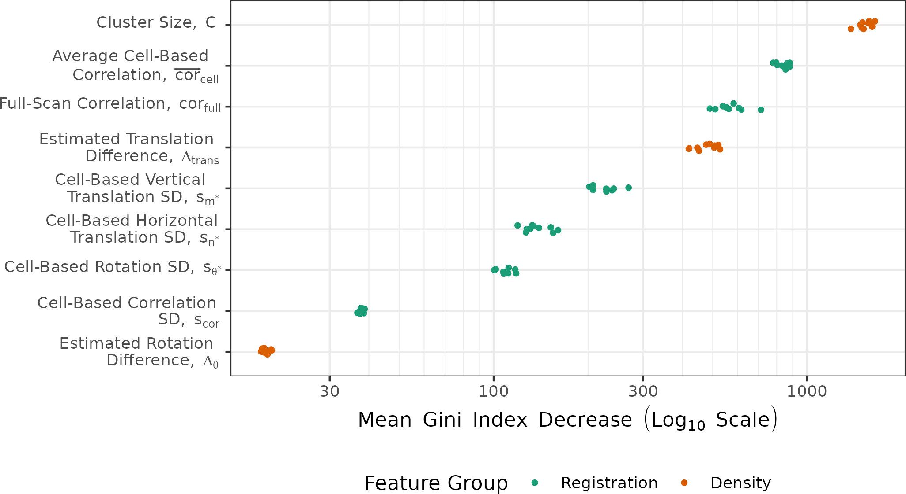
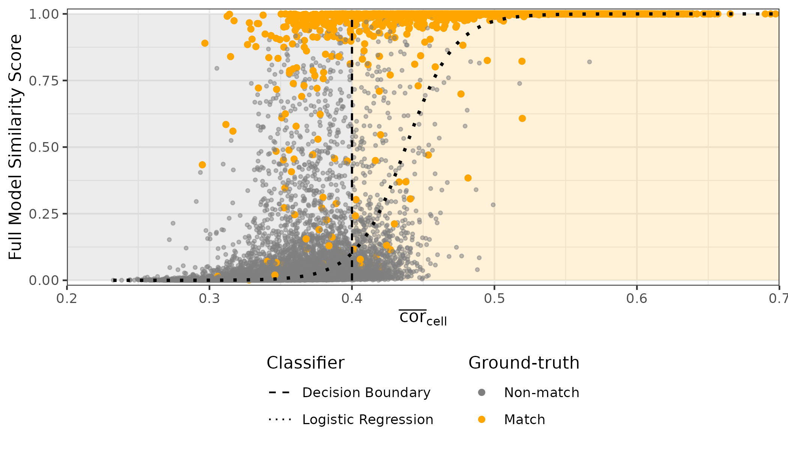
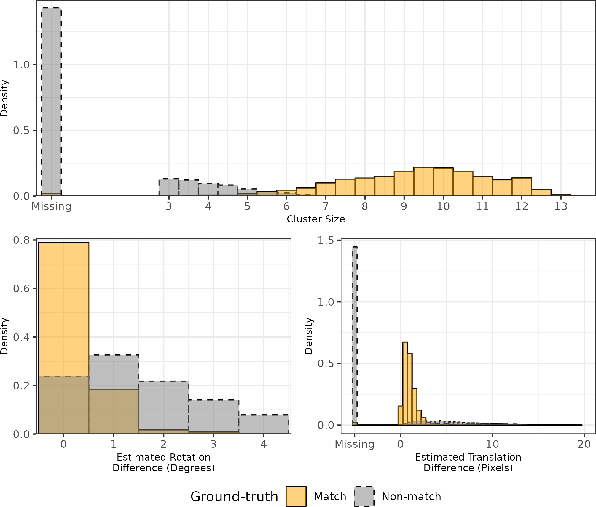

\defcitealias{council_strengthening_2009}{NRC (2009)}
\defcitealias{pcast2016}{PCAST (2016)}

```{r setup, include=FALSE}
library(x3ptools)
library(cmcR)
library(impressions)

library(patchwork)
library(tidyverse)

# Use fig.process to rename figure files generated by R so that they comply with
# the journal naming policies. Remember to name plot chunks with the format
# "Figure1", "Figure2", etc... You will find the figure files in
# `[...]_files/figure-latex/`.

knitr::opts_chunk$set(
  echo = TRUE,
  out.width="\\reprintcolumnwidth",
  fig.process = function(x) {
    x2 = sub('-\\d+([.][a-z]+)$', '\\1', x)
    if (file.rename(x, x2)) x2 else x
  }
)

# The JASA LaTeX class depends on the LaTeX package "revtex4-1". If you are
# using a full LaTeX distro, you should make sure "revtex4-1" is installed, and
# install it if not. If you are using TinyTeX, the following code will take care
# of installing the package for you.

if (tinytex::is_tinytex() && !tinytex::check_installed('revtex4-1')) {
  tinytex::tlmgr_install("revtex4-1")
}
```


# Background & Introduction {#introduction}

A *cartride case* is the part of firearm ammunition that houses the projectile and propulsive device.
When a firearm is discharged and the projectile travels down the barrel, the cartridge case moves in the opposite direction and slams against the back wall, the *breech face*, of the firearm.
Markings on the breech face are "stamped" into the surface of the cartridge case leaving so-called *breech face impressions*.
In this paper, we introduce an automatic method for measuring the similarity between two cartridge cases based on their breech face impressions.

## Traditional Cartridge Case Comparison

In a traditional examination, forensic examiners use these impressions analogous to a fingerprint to determine whether two cartridge cases were fired from the same firearm.
First, two cartridge cases are collected - perhaps one is from a crime scene and the other is collected from a suspect's gun.
An examiner places the two cartridge cases beneath a "comparison microscope" that merges the views of two compound microscopes into a single split view [@Thompson2017].
The examiner assesses the "degree of similarity" between the markings on the cartridge cases and reaches either an *identification*, meaning the cartridge cases were fired from the same firearm, an *elimination*, meaning they were fired from different firearms, or an *inconclusive*, meaning the evidence is insufficient to make an identification or elimination [@AFTE1992].^[The AFTE range of conclusions also permits the examiner to decide that the evidence is *unsuitable* for examination, which can occur if evidence quality is poor; for example, a fragment of a cartridge case is recovered rather than a full cartridge case.]

Critics of traditional forensic examinations cite a lack of "foundational validity" underlying the procedures used by firearm and toolmark examiners [@council_strengthening_2009; @pcast2016].
In particular, examiners rely largely on their subjective findings rather than on a well-defined procedure to measure similarity.
\citetalias{pcast2016} pushed for "developing and testing image-analysis algorithms" to objectively measure the similarity between cartridge cases.

In this paper, we introduce a procedure to automatically compare digital scans of cartridge cases.
Throughout this paper, we use scans, taken by us [paper submitted to scientific data], of 510 cartridge cases collected by @Baldwin2014.
The cartridge case scans are available as part of the data repository at [https://www.doi.org/10.25380/IASTATE.23837100.V1](https://www.doi.org/10.25380/IASTATE.23837100.V1) [@cartridgeCaseData].
We split this data set up into training and testing sets of size 210 and 300 scans, respectively, to learn and validate model parameters.
Code to reproduce the results shared in this paper are available at [https://github.com/jzemmels/rules_vs_scores](https://github.com/jzemmels/rules_vs_scores).

## Algorithmic Cartridge Case Comparisons

### Cartridge Case Surface Scans

We captured digital representations of cartridge case surfaces using topographic scanning technology.
The scanner measures the relative surface depth and stores these measurements in a 2D array called a *surface matrix*.
The left side of \autoref{fig:preProcessEffect} depicts a surface matrix representing the region at the base of a cartridge case surface called the *primer*, which is the circular metal cap struck by the firing pin to initiate the firing process.
The purple ring near the edges of the scan represent the boundary of the cartridge case primer while the darker orange ring near the center of the scan represents the deformation of metal caused by the contact with the firing pin.

Of particular interest is the annular breech face impression region around the firing pin impression.
We isolate this region by applying a series of manual and automatic pre-processing steps to the surface matrix, resulting in the scan on the right side of \autoref{fig:preProcessEffect}.
The gray pixels in this image represent structurally missing values introduced during pre-processing.
See **[scientific data citation]** for more information on the pre-processing procedure.

```{r prepare-reference, include=FALSE,cache = TRUE}
reference <- x3p_read("data/NIST_K013sA1.x3p") %>%
  x3ptools::x3p_scale_unit(scale_by = 1e6)

reference_eroded <- reference %>%
  impressions::x3p_delete(mask_vals = "#CD7F32FF") %>%
  cmcR::preProcess_removeTrend(statistic = "quantile",
                               tau = .5,
                               method = "fn") %>%
  cmcR::preProcess_gaussFilter() %>%
  x3p_sample() %>%
  cmcR::preProcess_removeTrend(statistic = "quantile",
                               tau = .5,
                               method = "fn") %>%
  cmcR::preProcess_gaussFilter() %>%
  x3p_sample() %>%
  cmcR::preProcess_erode(region = "interior",morphRadius = round(50/4)) %>% 
  cmcR::preProcess_erode(region = "exterior",morphRadius =  round(50/4)) %>%
  impressions::x3p_cropWS()
```

```{r raw-vs-processed-plot,cache = FALSE,include=FALSE}
plts <- impressions::x3pPlot(reference %>% x3p_sample(m = 2),reference_eroded,
                             x3p.names = c("Original Surface Matrix","BF Impression Region Extracted & Pre-processed"),
                             output = "list",
                             legend.quantiles = c(0,.5,1)) %>%
  map(~ {
    . +
      theme(legend.position = "bottom") +
      ggplot2::guides(fill = ggplot2::guide_colourbar(barwidth = grid::unit(1.75, 
                                                                            "in"), 
                                                      barheight = grid::unit(.2,"in"),
                                                      label.theme = ggplot2::element_text(size = 6), 
                                                      title.theme = ggplot2::element_text(size = 8), 
                                                      title.vjust = .8,
                                                      frame.colour = "black",
                                                      ticks.colour = "black",
                                                      direction = "horizontal"), 
                      colour = "none") + 
      ggplot2::labs(fill = expression("Rel. Height ["*mu*"m]"))
  })

plt <- (plts[[1]] | plts[[2]])

ggsave(plot = plt,filename = "figures/preProcessEffect.png",width = 10,height = 5,dpi = 300)
knitr::plot_crop("figures/preProcessEffect.png")
```


```{r,out.width=".5\\textwidth",echo=FALSE,fig.pos="htbp",fig.cap="\\label{fig:preProcessEffect} We apply a sequence of pre-processing functions to each scan. Each pre-processing step further emphasizes the breech face impressions in the scan.",fig.env="figure"}
knitr::include_graphics("figures/preProcessEffect.png")
```

```{r preprocessScans,include=FALSE,cache=TRUE}
target <- x3p_read("data/NIST_K013sA2.x3p") %>%
  x3p_scale_unit(scale_by = 1e6)

target_eroded <- target %>%
  impressions::x3p_delete(mask_vals = "#CD7F32FF") %>%
  cmcR::preProcess_removeTrend(statistic = "quantile",
                               tau = .5,
                               method = "fn") %>%
  cmcR::preProcess_gaussFilter() %>%
  x3p_sample() %>%
  cmcR::preProcess_removeTrend(statistic = "quantile",
                               tau = .5,
                               method = "fn") %>%
  cmcR::preProcess_gaussFilter() %>%
  x3p_sample() %>%
  cmcR::preProcess_erode(region = "interior",morphRadius = round(50/4)) %>% 
  cmcR::preProcess_erode(region = "exterior",morphRadius =  round(50/4)) %>%
  impressions::x3p_cropWS()
```

```{r,include=FALSE}
if(!file.exists("data/compData.rds")){
  fullScanComparison <-
    scored::comparison_fullScan(reference_eroded,target_eroded,
                                thetas = seq(-30,30,by = 3),
                                returnX3Ps = TRUE) %>%
    group_by(direction) %>%
    filter(fft_ccf == max(fft_ccf)) %>%
    ungroup()
  
  cellComparison <-
    bind_rows(
      scored::comparison_cellBased(fullScanComparison$cellHeightValues[[1]],
                                   fullScanComparison$alignedTargetCell[[1]],
                                   thetas = -2:2,
                                   direction = "one",
                                   numCells = c(4,4),
                                   maxMissingProp = .99,
                                   sideLengthMultiplier = 1.1,
                                   returnX3Ps = FALSE) %>%
        mutate(direction = "reference_vs_target"),
      scored::comparison_cellBased(fullScanComparison$cellHeightValues[[2]],
                                   fullScanComparison$alignedTargetCell[[2]],
                                   thetas = -2:2,
                                   direction = "one",
                                   numCells = c(4,4),
                                   maxMissingProp = .99,
                                   sideLengthMultiplier = 1.1,
                                   returnX3Ps = FALSE) %>%
        mutate(direction = "target_vs_reference")
    )
  
  saveRDS(cellComparison,file = "data/compData.rds")
}

if(!file.exists("data/compData_8x8.rds")){
  cellComparison_8x8 <-
    scored::comparison_cellBased(fullScanComparison$cellHeightValues[[1]],
                                 fullScanComparison$alignedTargetCell[[1]],
                                 thetas = -2:2,
                                 direction = "one",
                                 numCells = c(8,8),
                                 maxMissingProp = .99,
                                 sideLengthMultiplier = 1.1,
                                 returnX3Ps = TRUE) %>%
    mutate(direction = "reference_vs_target",
           cmcClassif = cmcR::decision_CMC(cellIndex,x,y,theta,pairwiseCompCor))
  
  saveRDS(cellComparison_8x8,file = "data/compData_8x8.rds") 
}
```

```{r,include=FALSE}
compData <- readRDS("data/compData.rds")
compData_8x8 <- readRDS("data/compData_8x8.rds")
```


Two pre-processed cartridge cases are compared to measure the similarity of their breech face impressions.
In the next section, we summarize a technique for comparing cartridge case scans called the *Congruent Matching Cells* algorithm [@song_proposed_2013]. 

### Congruent Matching Cells Algorithm

Recent proposals for automatic cartridge case scoring algorithms borrow from image processing and computer vision techniques.
For example, @vorburger_surface_2007 proposed using the cross-correlation function (CCF) to compare images or scans of cartridge case surfaces.
The CCF measures the similarity between two matrices for all possible translations of one matrix against the other.
Calculating the CCF while rotating one of the scans therefore allows for estimation of the optimal translation and rotation, together referred to as the *registration*, between the two scans;  simply choose the rotation/translation at which the CCF is maximized.
<!-- @hare_automatic_2016 used the CCF, among other features, to compare scans of bullets. -->
<!-- @tai_fully_2018 developed an open-source cartridge case comparison pipeline that compared cartridge case images using the CCF. -->

@song_proposed_2013 noted that two matching cartridge cases often share similar impressions in specific regions, so calculating the CCF between two full scans may not highlight their similarities.
Instead, @song_proposed_2013 proposed partitioning one cartridge case scan into a grid of "cells" and calculating the CCF between each cell and the other scan.
If two cartridge cases are truly matching, then the maximum CCF value between each cell and the other scan, particularly the cells containing distinguishable breech face impressions, should be relatively large.

Furthermore, the cells should "agree" on the registration at which the CCF is maximized.
Numerically, two cells "agree" on a registration when their estimated rotation and translation are equal (although we typically allow a small amount of variability).
Visually, we can identify cells in agreement by whether they retain their shared spatial relationship after registering in the other scan.
\autoref{fig:cellregistrations} shows an example of estimated cell registrations between two same-source cartridge cases.
In this example, Scan A is partitioned into an $8 \times 8$ grid of cells, identified with "row #, column #" labels, each of which are registered in Scan B.
We see that many cells retain their spatial relationship after registration; for example, cell 2, 1 is directly above cell 3, 1 and to the left of cell 2, 2 - all three of these cells agree (approximately) on the same registration.
Comparatively, cells 8, 2 and 8, 3, which should be side-by-side in both scans, clearly do not agree on the same registration in Scan B.
The more cells that agree on a registration, the stronger the evidence that the two cartridge cases are truly same-source.

```{r,include=FALSE}
cmcClassif_8x8 <- compData_8x8 %>%
  filter(cmcClassif == "CMC")

cmcClassif_8x8 <- 
  bind_rows(cmcClassif_8x8,
            compData_8x8 %>%
              filter(!(cellIndex %in% cmcClassif_8x8$cellIndex)) %>%
              group_by(cellIndex) %>%
              filter(fft_ccf == max(fft_ccf)) %>%
              ungroup())

plt <-
  cmcR::cmcPlot(reference_eroded,target_eroded,
                cmcClassifs = cmcClassif_8x8 %>% mutate(cmcClassif = "CMC"),
                cmcCol = "cmcClassif",type = "list")

cmcplot <- (plt$reference + 
              theme(strip.text = element_blank(),
                    plot.subtitle = element_text(hjust = .5,size = 10)) + 
              labs(subtitle = "Scan A")) | 
  (plt$target + 
     theme(strip.text = element_blank(),
           plot.subtitle = element_text(hjust = .5,size = 10)) + 
     labs(subtitle = "Scan B"))

ggsave(cmcplot,filename = "figures/cellregistrations.png",height = 5,width = 10,bg = "white")
knitr::plot_crop("figures/cellregistrations.png")
```

```{r,out.width=".5\\textwidth",fig.env="figure",echo=FALSE,fig.pos="htbp",fig.cap="\\label{fig:cellregistrations} A visualization of estimated cell registrations between two same-source cartridge cases. Scan A is partitioned into an $8 \\times 8$ grid of cells, each of which are registered in Scan B. For two same-source cartridge cases, we expect cells to agree on the same registration, meaning they retain their shared spatial relationship in both scans."}
knitr::include_graphics("figures/cellregistrations.png")
```

@song_proposed_2013 outlined the "Congruent Matching Cells" algorithm to determine the number of cells that agree on a particular registration.
A cell is classified as a Congruent Matching Cell (CMC) if its estimated registration is within some threshold of the median registration across all cells and its CCF value is above some threshold (see \ref{appendixCMC} for more details).
A number of follow-up papers proposed alterations to the the original CMC method [@tong_improved_2015; @chen_convergence_2017].
@cmcR introduced an open-source implementation of the CMC method in the `cmcR` R package.
As an alternative to defining Congruent Matching Cells, @zhang_convergence_2021 proposed using a clustering algorithm from @Ester1996 to determine the number of cells in agreement on a specific registration.

The underlying CMC criteria are a set of binary rules; for example, a cell's associated registration either is or is not within a pre-defined threshold of the consensus-estimated registration.
While interpretable, these threshold-based rules are quite sensitive to the choice of threshold as demonstrated in @Zemmels2023.
We propose a more robust, model-based method that relies on numerical features to measure the strength of consensus rather than binary criteria.
We also introduce a novel cross-validation procedure to learn and test optimal parameters for this cartridge case algorithm.


# Methods {#methods}

## Notational Conventions

First, we establish notation that will be used to define the features.
We introduce additional notation in subsequent sections as it becomes relevant.
Let $A$ and $B$ denote two surfaces matrices that we wish to compare.
For simplicity, we assume $A,B \in \mathbb{R}^{k \times k}$ for a positive integer $k$.\footnote{This assumption of equally-sized, square matrices is easily enforced by padding the matrices with additional missing values.
Due to the presence of (structurally) missing values around the breech face impression region, additional padding does not interfere with the structure of the scan.}
We use lowercase letters and subscripts to denote a particular value of a matrix: $a_{ij}$ is the value in the $i$-th row and $j$-th column, indexed starting from the top-left corner, of matrix $A$.

To accommodate structurally missing values, we adapt standard matrix algebra by encoding the notion of "missingness" into the space of real values as follows: if an element of either matrix $A$ or $B$ is missing, then any element-wise operation including this element is also missing.
Standard matrix algebra holds for non-missing elements.
For example, the addition operator is defined as:
\begin{align*}
A \oplus_{NA} B &= (a_{ij} \oplus_{NA} b_{ij})_{1 \leq i,j \leq k} \\
&=  \begin{cases}
a_{ij} + b_{ij} & \text{if both $a_{ij}$ and $b_{ij}$ are numbers} \\
NA &\text{otherwise}
\end{cases}
\end{align*}
Other element-wise operations such as $\ominus_{NA}$ are defined similarly.
For readability, we will use standard operator notation $+, -, >, <, I(\cdot), ...$ and assume the extended, element-wise operations as defined above.
Note that this definition of dealing with missing values is consistent with a setting of `na.rm = FALSE` in terms of calculations in R [@Rlanguage].

We call cartridge cases that originated from the same firearm "matches" and those that originated from different firearms "non-matches."
In the following sections, we use the two known-match cartridge cases in \autoref{fig:matchPair} as example matrices $A$ and $B$.

## Registration Estimation

A critical step in comparing $A$ and $B$ is to find a transformation of $B$ such that it aligns best to $A$ (or vice versa).
In image processing, this is called *image registration.* 
Noting that $A$ and $B$ are essentially grayscale images with structurally missing values, we rely on a standard image registration technique [@Brown1992].

In our application, a registration is composed of a discrete translation by $(m,n) \in \mathbb{Z}^2$ and rotation by $\theta \in [-180^\circ,180^\circ]$.
To determine the optimal registration, we calculate the *cross-correlation function* (CCF) between $A$ and $B$, denoted $(A \star B)$, which measures the similarity between $A$ and $B$ for every possible translation of $B$.
We estimate the registration by calculating the maximum CCF value across a range of rotations of matrix $B$.
Let $B_\theta$ denote $B$ rotated by an angle $\theta \in [-180^\circ,180^\circ]$ and $b_{\theta_{mn}}$ the $m,n$-th element of $B_\theta$.
Then the estimated registration $(m^*,n^*,\theta^*)$ is: 

$$
(m^*,n^*,\theta^*) = \arg \max_{m,n,\theta} (a \star b_\theta)_{mn}.
$$

In practice we consider a discrete grid of rotations $\pmb{\Theta} \subset [-180^\circ,180^\circ]$.
The registration procedure is outlined in \autoref{alg:registration}.
We refer to the matrix that is rotated as the "target."
The result is the estimated registration of the target matrix to the "source" matrix.

```{=tex}
\begin{algorithm}[htbp]
\caption{Image Registration Procedure}\label{alg:registration}
\KwData{Source matrix $A$, target matrix $B$, and rotation grid $\pmb{\Theta}$}
\KwResult{Estimated registration of $B$ to $A$, $(m^*,n^*,\theta^*)$, and cross-correlation function maximum, $CCF_{\max}$}
\For{$\theta \in \pmb{\Theta}$}{
Rotate $B$ by $\theta$ to obtain $B_\theta$\;
Calculate $CCF_{\max, \theta} = \max_{m,n} (a \star b_{\theta})_{mn}$\;
Calculate translation $[m^*_\theta,n^*_\theta] = \arg \max_{m,n} (a \star b_{\theta})_{mn}$
}
Calculate overall maximum correlation $CCF_{\max} = \max_{\theta} \{CCF_{\max,\theta} : \theta \in \pmb{\Theta}\}$\;
Calculate rotation $\theta^* = \arg \max_{\theta} \{CCF_{\max,\theta} : \theta \in \pmb{\Theta}\}$\;
\Return{Estimated rotation $\theta^*$, translation $m^* = m^*_{\theta^*}$ and $n^* = n^*_{\theta^*}$, and $CCF_{\max}$}
\end{algorithm}
```

```{r,cache=FALSE,include=FALSE}
plt <- impressions::x3pPlot(reference_eroded,target_eroded,x3p.names = c("Scan A","Scan B"),legend.length = grid::unit(4, "in"))

ggsave(filename = "figures/matchPair.png",plot = plt,height = 7,width = 10)
knitr::plot_crop("figures/matchPair.png")
```


```{r,out.width=".5\\textwidth",echo=FALSE,fig.pos="htbp",fig.cap="\\label{fig:matchPair} A matching pair of processed cartridge case scans. We measure the similarity between these cartridge cases using the distinguishable breech face impressions on their surfaces."}

```

Note that the calculation of the CCF requires that all missing values, including structural missing values, are imputed in $A$ and $B$.
We impute missing values in a scan with the average non-missing value in that scan.
As a result of imputing a large number of missing values, we found in our experimentation the estimated registrations $(\theta^*, m^*, n^*)$ to be reliable but the value of $CCF_{\max}$ to not be a reliable measure of similarity for scans.
We discuss how we compute more reliable measures of similarity in \ref{featureCalculation}.

### Full-Scan Registration

We first estimate the registration between two full scans $A$ and $B$ using \autoref{alg:registration} with a rotation grid $\pmb{\Theta} = \{-30^\circ, -27^\circ,...,27^\circ,30^\circ\}$.
This results in an estimated registration $(m^*,n^*,\theta^*)$ and similarity measure $CCF_{\max}$.
We also perform \autoref{alg:registration} with the roles of $A$ and $B$ reversed, meaning the target scan $A$ is aligned to source scan $B$.

To accommodate these two comparison directions, we introduce a new subscript $d = A,B$, referring to the source scan in \autoref{alg:registration}.
Consequently, we obtain two sets of estimated registrations, $(m^*_d,n^*_d,\theta^*_d)$ and $CCF_{\max,d}$, for $d=A,B$.\footnote{In reality, the true aligning registrations in the two comparison directions are opposites of each other. However, because we compare discretely-indexed arrays using a nearest-neighbor interpolation scheme, the estimated registrations may differ slightly.}

### Cell-Based Registration

We next perform a cell-based comparison procedure, which begins with selecting one of the matrices, say $A$, as the "source" matrix that is partitioned into a grid of cells.
The left side of \autoref{fig:cellGridExample} shows an example of such a cell grid overlaid on a scan.
Each of these source cells will be compared to the "target" matrix, in this case $B^*$.
Because $A$ and $B^*$ are already partially aligned from the full-scan registration procedure, we compare each source cell to $B^*$ using a new rotation grid of $\pmb{\Theta}'_A = \{\theta^*_A - 2^\circ, \theta^*_A - 1^\circ,\theta^*_A,\theta^*_A + 1^\circ,\theta^*_A + 2^\circ\}$.

We now extend the surface matrix notation introduced previously to accommodate cells.
Let $A_{t}$ denote the $t$-th cell of matrix $A$, $t = 1,...,T_A$ where $T_A$ is the total number of cells containing non-missing values in scan $A$ (e.g., $T_A = 43$ in \autoref{fig:cellGridExample}) and let $(a_t)_{ij}$ denote the $i,j$-th element of $A_t$.
The cell-based comparison procedure is outlined in \autoref{alg:cellComparison}.

```{=tex}
\begin{algorithm}[H]
\KwData{Source matrix $A$, target matrix $B^*$, grid size $R \times C$, and rotation grid $\pmb{\Theta}'_A$}
\KwResult{Estimated translations and $CCF_{\max}$ values per cell, per rotation}
Partition $A$ into a grid of $R \times C$ cells\;
Discard cells containing only missing values, leaving $T_A$ remaining cells\;
\For{$\theta \in \pmb{\Theta}'_A$}{
Rotate $B^*$ by $\theta$ to obtain $B^*_\theta$\;
\For{$t = 1,...,T_A$}{
Calculate $CCF_{\max, A,t,\theta} = \max_{m,n} (a_t \star b^*_\theta)_{mn}$\;
Calculate translation $[m^*_{A,t,\theta},n^*_{A,t,\theta}] = \arg \max_{m,n} (a_t \star b^*_\theta)_{mn}$
}
}
\Return{$\pmb{F}_A = \{(\theta, m^*_{A,t,\theta},n^*_{A,t,\theta}, CCF_{\max,A,t,\theta}) : \theta \in \pmb{\Theta}'_A, t = 1,...,T_A\}$}
\caption{Cell-Based Comparison Procedure}
\label{alg:cellComparison}
\end{algorithm}
```

We can think of \autoref{alg:registration} as a specific case of \autoref{alg:cellComparison} where $R = C = 1$, but we distinguish the algorithms in this paper based on the intended use of the result. 
Rather than exclusively returning the registration that maximizes the overall CCF as in \autoref{alg:registration}, \autoref{alg:cellComparison} returns the set $\pmb{F}_A$ of translations and CCF values for each of the $T_A$ cells and each rotation in $\pmb{\Theta}'_A$.

```{r,out.width=".5\\textwidth",fig.env = "figure",echo=FALSE,fig.pos="htbp",fig.cap="\\label{fig:cellGridExample} Estimated registrations of cells from a non-match pair of cartridge cases. A source scan (left) is separated into an $8 \\times 8$ grid of cells. We exclude cells containing only missing values (visualized here as gray pixels). Each source cell is compared to a target scan (right) to estimate where it aligns best. We show a handful of cells at their estimated alignment in the target scan and magnify the surfaces captured by cell pairs 5, 1 and 7, 7. Although the cartridge case pair is non-matching, we note that there are similarities in the surface markings for these cell pairs."}
knitr::include_graphics("images/cellGridExample_nonMatch.png")
```

\autoref{fig:cellGridExample} shows the estimated registrations of cells between two non-match cartridge cases.
We magnify the surface values captured by cell pairs 5, 1 and 7, 7 and note the similarities in the surface values;  for example, the dark purple region in the middle of the cell 7, 7 pair.

Next, we introduce a set of similarity features for two cartridge case scans.
We calculate features at two scales: between two full scans and between individual cells.
Analogous to how a forensic examiner uses a comparison microscope with different magnification levels, this allows us to assess the similarity between two scans at the macro and micro levels.

## Feature Calculation {#featureCalculation}

The result of the full scan and cell-based comparisons is a set of estimated registrations with associated $CCF_{\max}$ values.
We compute statistics on these results based on how we expect these registrations to behave for matching vs. non-matching cartridge case pairs.
Similar to the assumption made in the Congruent Matching Cells algorithm, we expect that cells will agree on a particular registration if the two cartridge cases truly match, suggesting that a measure of spread of the estimated registrations would be an informative statistic.
Further, we would expect that the consensus-estimated registrations should be approximately opposite across the two comparison directions (i.e., registering $A$ to $B$ is the opposite of registering $B$ to $A$).

We first introduce a set of *registration-based features* based on descriptive statistics of the full scan and cell-based registrations.
Then, we discuss a set of *density-based features* based on applying a density-based clustering algorithm to the cell registrations $\pmb{F}_A$ and $\pmb{F}_B$.

### Registration-based Features

For $d = A$, we apply the registration transformation $(m^*_A,n^*_A,\theta^*_A)$ to $B$ to obtain $B^*$.
Because the calculation of the $CCF_{\max}$ requires imputing missing values in both the source and target scans, we found the $CCF_{\max}$ values to not be a reliable measure of similarity for two cartridge cases.
Instead, we compute the *pairwise-complete correlation*, $cor$, which is equivalent to the Pearson correlation between the overlapping, non-missing elements of $A$ and $B^*$.

We compute the pairwise-complete correlation between $A$ and $B^*$, resulting in $cor_{\text{full},A}$.
We repeat this in the other comparison direction to obtain $cor_{\text{full},B}$ and average the two: $cor_{\text{full}} = \frac{1}{2}\left(cor_{A,\text{full}} + cor_{B,\text{full}}\right)$.
We assume that the **full-scan pairwise-complete correlation**, $cor_{\text{full}}$, is large for truly matching cartridge cases.

Just as with the whole-scan registration, we calculate the pairwise-complete correlation between each cell $A_t$ and a matrix $B_{\theta,t}^*$ of the same size extracted from $B^*_{\theta}$ after translating by $[m^*_{A,\theta},n^*_{A,\theta}]$.
From this we obtain a set of pairwise-complete correlations for each cell and rotation: $\{cor_{A,t,\theta} : t = 1,...,T_A, \theta \in \pmb{\Theta}'_A\}$.

We repeat \autoref{alg:cellComparison} and the pairwise-complete correlation calculation using $B$ as the source scan and $A^*$ as the target, resulting in cell-based registration set $\pmb{F}_B$ and pairwise-complete correlations $\{cor_{B,t,\theta} : t = 1,...,T_B, \theta \in \pmb{\Theta}'_B\}$.

For $d = A,B$ and $t = 1,...,T_d$, define the cell-wise maximum pairwise-complete correlation as: 

$$
cor_{d,t} = \max_{\theta} \{cor_{d,t,\theta} : \theta \in \pmb{\Theta}'_d\}.
$$

We compute two features, the **average** and **standard deviation of the cell-based pairwise-complete correlations**, using the correlation data:

\begin{align*}
\overline{cor}_{\text{cell}} &= \frac{1}{T_A + T_B} \sum_{d \in \{A,B\}} \sum_{t=1}^{T_d} cor_{d,t} \\
s_{cor} &= \sqrt{\frac{1}{T_A + T_B - 1} \sum_{d \in \{A,B\}} \sum_{t=1}^{T_d} (cor_{d,t} - \overline{cor}_{\text{cell}})^2}.
\end{align*} 

We expect $\overline{cor}_{\text{cell}}$ and $s_{cor}$ to be large for truly matching cartridge case pairs relative to non-matching pairs.

For $d = A,B$ and $t = 1,...,T_d$, define the per-cell estimated translations and rotation as: 

\begin{align*}
\theta^*_{d,t} &= \arg \max_{\theta} \{CCF_{\max,d,t,\theta} : \theta \in \pmb{\Theta}'_d\} \\
m^*_{d,t} &= m^*_{\theta^*_{d,t},d,t} \\
n^*_{d,t} &= n^*_{\theta^*_{d,t},d,t}.
\end{align*} 

We compute the **standard deviation of the cell-based estimated registrations** using the estimated translations and rotations:

\begin{align*}
s_{\theta^*} =  \sqrt{\frac{1}{T_A + T_B - 1} \sum_{d \in \{A,B\}} \sum_{t=1}^{T_d} (\theta^*_{d,t} - \bar{\theta}^*)^2} \\
s_{m^*} =  \sqrt{\frac{1}{T_A + T_B - 1} \sum_{d \in \{A,B\}} \sum_{t=1}^{T_d} (m^*_{d,t} - \bar{m}^*)^2} \\
s_{n^*} = \sqrt{\frac{1}{T_A + T_B - 1} \sum_{d \in \{A,B\}} \sum_{t=1}^{T_d} (n^*_{d,t} - \bar{n}^*)^2}
\end{align*}

where 

\begin{align*}
\bar{m}^* &= \frac{1}{T_A + T_B} \sum_{d \in \{A,B\}}\sum_{t=1}^{T_d} m^*_{d,t} \\
\bar{n}^* &= \frac{1}{T_A + T_B} \sum_{d \in \{A,B\}} \sum_{t=1}^{T_d} n^*_{d,t} \\
\bar{\theta}^* &= \frac{1}{T_A + T_B} \sum_{d \in \{A,B\}} \sum_{t=1}^{T_d} \theta^*_{d,t}.
\end{align*}

We expect $s_{\theta^*}, s_{m^*},s_{n^*}$ to be small for truly matching cartridge case pairs relative to non-matching pairs.

### Density-Based Features

We wish to identify when multiple cells agree on, or cluster around, a particular registration value.
However, pursuant with the notion that only certain regions of matching cartridge cases contain distinctive markings, it is unreasonable to assume and empirically rare that **all** cells agree on a single registration.
<!-- In fact, it is common for many cells to disagree on a registration. -->
For example, the left scatterplot in \autoref{fig:dbscanScatterplot} shows the per-cell estimated translations $[m^*_{A,t,\theta}, n^*_{A,t,\theta}]$ when scan $A$ is used as source and $B^*$ as target rotated by $\theta = 3^\circ$.
The right scatterplot shows the per-cell estimated translations with the roles of $A$ and $B^*$ reversed for $\theta = -3^\circ$.
We see distinctive clusters, the black points, in both plots among many noisy, gray points.
The task is to isolate the clusters among such noise.

We use the Density-Based Spatial Clustering of Applications with Noise (DBSCAN) algorithm proposed by @Ester1996 to identify clusters.
Compared to other clustering algorithms such as k-means [@MacQueen1967], DBSCAN does not require a pre-defined number of expected clusters.
Instead, the algorithm forms clusters if the number of points within an $\epsilon > 0$ distance of a point exceeds some pre-defined threshold, $minPts > 1$.
If a point does not belong to a cluster, then DBSCAN labels that point as "noise."

In \autoref{fig:dbscanScatterplot}, we use a $4 \times 4$ grid of cells to which we apply DBSCAN with $\epsilon = 3$ and $minPts = 3$.
The resulting clusters for the two comparison directions are 7 and 9 cells, respectively, visualized in \autoref{fig:dbscanScatterplot} as black points.
This indicates that about half of the cells in the $4 \times 4$ grid agree on a registration in both comparison directions.
Additionally, the mean cluster centers are approximately close to 0: $(\hat{m}_A,\hat{n}_A,\hat{\theta}_A) \approx (0.29, 0.57, 0^\circ)$ when $A$ is used as source compared to $(\hat{m}_B,\hat{n}_B,\hat{\theta}_B) \approx (-0.67, 0.00, 0^\circ)$ when $B^*$ is used as source.
If $A$ and $B$ were truly matching and the full scan registration from \autoref{alg:registration} successfully aligned the two scans, then we wouldn't expect the cells to move much in their respective registrations, which is illustrated in this example.
For non-matching scans, we wouldn't expect the cell registrations to agree only by coincidence.

```{r,cache=FALSE,include=FALSE}
estimRotations <- compData %>%
  group_by(direction,theta) %>%
  group_split() %>%
  map_dfr(function(dat){
    
    densEstim <- MASS::kde2d(x = dat$x,y = dat$y,n = 100)
    
    data.frame(maxDens = max(c(densEstim$z)),
               theta = unique(dat$theta),
               direction = unique(dat$direction))
    
  }) %>%
  group_by(direction) %>%
  dplyr::top_n(n = 1,wt = maxDens) %>%
  select(direction,theta) %>%
  rename(thetaHat = theta)

plt1 <- compData %>%
  left_join(estimRotations,by = "direction") %>%
  filter(theta == thetaHat) %>%
  mutate(direction = factor(direction,labels = c("Scan A vs. Scan B*","Scan B* vs. Scan A")),
         label = paste0(direction,", Rotation: ",theta)) %>%
  filter(direction == "Scan A vs. Scan B*") %>%
  group_by(label) %>%
  group_split() %>%
  map_dfr(function(dat){
    
    dat %>%
      mutate(clust = dbscan::dbscan(x = dat %>% select(x,y),eps = 5,minPts = 5)$cluster,
             clust = factor(ifelse(clust == 0,0,1),labels = c("Noise","Cluster")))
    
  }) %>%
  ggplot(aes(x=x,y,y,colour = clust)) +
  # geom_point() +
  geom_jitter(width = 3,height = 3,size = 1) +
  coord_fixed(expand = TRUE) +
  facet_wrap(~ label,nrow = 1) +
  theme_bw() +
  labs(x = "horizontal shift n",
       y = "vertical shift m",
       colour = "DBSCAN") +
  theme(axis.text = element_text(size = 6),
        legend.position = "bottom") +
  geom_vline(xintercept = 0,linetype = "dashed") +
  geom_hline(yintercept = 0,linetype = "dashed") +
  scale_colour_manual(values = c("gray65","black")) +
  xlim(c(-100,100)) +
  ylim(c(-100,100)) +
  theme(legend.position = "none")

plt2 <- compData %>%
  left_join(estimRotations,by = "direction") %>%
  filter(theta == thetaHat) %>%
  mutate(direction = factor(direction,labels = c("Scan A vs. Scan B*","Scan B* vs. Scan A")),
         label = paste0(direction,", Rotation: ",theta)) %>%
  filter(direction == "Scan B* vs. Scan A") %>%
  group_by(label) %>%
  group_split() %>%
  map_dfr(function(dat){
    
    dat %>%
      mutate(clust = dbscan::dbscan(x = dat %>% select(x,y),eps = 5,minPts = 5)$cluster,
             clust = factor(ifelse(clust == 0,0,1),labels = c("Noise","Cluster")))
    
  }) %>%
  ggplot(aes(x=x,y,y,colour = clust)) +
  # geom_point() +
  geom_jitter(width = 3,height = 3,size = 1) +
  coord_fixed(expand = TRUE) +
  facet_wrap(~ label,nrow = 1) +
  theme_bw() +
  labs(x = "(negative) horizontal shift n",
       y = "(negative) vertical shift m",
       colour = "DBSCAN") +
  theme(axis.text = element_text(size = 6),
        legend.position = "bottom") +
  geom_vline(xintercept = 0,linetype = "dashed") +
  geom_hline(yintercept = 0,linetype = "dashed") +
  scale_colour_manual(values = c("gray65","black")) +
  scale_x_reverse(limits = c(100,-100)) +
  scale_y_reverse(limits = c(100,-100)) +
  theme(legend.position = "none")

pltLegend <- plt1 %>%
  cowplot::get_legend() %>%
  cowplot::plot_grid()

ggsave(filename = "figures/dbscanScatterplot.png", plot = plt1+plt2, 
       width = 8, height = 4)
knitr::plot_crop("figures/dbscanScatterplot.png")
```


```{r,out.width=".5\\textwidth",echo=FALSE,fig.pos="htbp",fig.cap='\\label{fig:dbscanScatterplot} Cluster assignments based on the Density Based Spatial Clustering with Applications to Noise (DBSCAN) algorithm for estimated translations in two comparison directions. Clustered points are shown as black while "noise" points are gray. We see that the clusters are both centered near the origin, indicating no further transformation is needed. Points are jittered for visibility.'}
knitr::include_graphics("figures/dbscanScatterplot.png")
```

<!-- Using scan $A$ as source results in a cluster of size 14 (left) compared to 13 when scan $B^*$ is used as source (right).  -->

```{r,include=FALSE,eval=FALSE}
compData %>%
  left_join(estimRotations,by = "direction") %>%
  filter(theta == thetaHat) %>%
  mutate(direction = factor(direction,labels = c("Scan A vs. Scan B*","Scan B* vs. Scan A")),
         label = paste0(direction,", Rotation: ",theta)) %>%
  filter(direction == "Scan A vs. Scan B*") %>%
  group_by(label) %>%
  group_split() %>%
  map_dfr(function(dat){
    
    dat %>%
      mutate(clust = dbscan::dbscan(x = dat %>% select(x,y),eps = 3,minPts = 3)$cluster,
             clust = factor(ifelse(clust == 0,0,1),labels = c("Noise","Cluster")))
    
  }) %>%
  filter(clust == "Cluster") %>%
  summarize(clustSize = n(),x = mean(x),y = mean(y))

compData %>%
  left_join(estimRotations,by = "direction") %>%
  filter(theta == thetaHat) %>%
  mutate(direction = factor(direction,labels = c("Scan A vs. Scan B*","Scan B* vs. Scan A")),
         label = paste0(direction,", Rotation: ",theta)) %>%
  filter(direction == "Scan B* vs. Scan A") %>%
  group_by(label) %>%
  group_split() %>%
  map_dfr(function(dat){
    
    dat %>%
      mutate(clust = dbscan::dbscan(x = dat %>% select(x,y),eps = 3,minPts = 3)$cluster,
             clust = factor(ifelse(clust == 0,0,1),labels = c("Noise","Cluster")))
    
  }) %>%
  filter(clust == "Cluster") %>%
  summarize(clustSize = n(),x = mean(x),y = mean(y))
```

To calculate the density-based features, we first use a 2D kernel density estimator [@MASS] to identify the rotation $\hat{\theta}_d$ at which the per-cell translations achieve the highest density.
Next, we compute clusters using the DBSCAN algorithm amongst the estimated translations $\{(m^*_{d,t,\hat{\theta}_d},n^*_{d,t,\hat{\theta}_d}) : t = 1,...,T_d\}$ like those shown in \autoref{fig:dbscanScatterplot}.^[If more than one cluster is identified, we binarize the points based on whether they were assigned to any cluster or if they are a noise point and proceed as if there is only one cluster. We assume that two or more clusters form only because of the course rotation grid considered. Were a finer grid used, the points would coalesce into a single cluster around the true translation value. This assumption has empirical support through our experimentation.]
Let $\pmb{C}_d$ denote the set of cells in the DBSCAN cluster.
We treat the mean cluster centers as the estimated translations $[\hat{m}_d,\hat{n}_d]$.

We calculate four features from the density-based clustering procedure: **average DBSCAN cluster size** $C$, the **DBSCAN cluster indicator** $C_0$, and the **root sum of squares of the dens**ity-estimated registrations $(\Delta_\theta, \Delta_{\text{trans}})$ defined as:

\begin{align*}
C &= \frac{1}{2}\left(|\pmb{C}_A| + |\pmb{C}_B|\right) \\
C_0 &= I(|\pmb{C}_A| > 0 \text{ and } |\pmb{C}_B| > 0)\\
\Delta_\theta &= |\hat{\theta}_A + \hat{\theta}_B| \\
\Delta_{\text{trans}} &= \sqrt{(\hat{m}_A + \hat{m}_B)^2 + (\hat{n}_A + \hat{n}_B)^2}
\end{align*} 
where $|\pmb{C}_d|$ denotes the cardinality of $\pmb{C}_d$ and $I(\cdot)$ is the identity function equal to 1 if the predicate argument "$\cdot$" evaluates to TRUE and 0 otherwise.
We use both $C$ and $C_0$ because of potential missingness in the values of $C$ if no cluster is identified.
Missing $C$ values are imputed using the median non-missing value when fitting classifiers, so the missingness information is retained in $C_0$.

For truly matching cartridge case pairs, we expect $C$ to be large and $\Delta_\theta, \Delta_{\text{trans}}$ to be small relative to non-matching pairs and for $C_0$ to be equal to 1.

In summary, there are 10 total features, 6 registration-based and 4 density-based, that we calculate for each cartridge case pair.
We list the 10 features in \autoref{tab:allFeatures}.
In the next section, we discuss how we use these features in a model-based approach to obtain similarity scores.

```{=tex}
\begin{table}[htbp]
\centering
\begin{tabular}{p{.4\linewidth}p{.59\linewidth}}
$cor_{\text{full}} \in [0,1]$ & Full-scan pairwise-complete correlation \\
$\overline{cor}_{\text{cell}} \in [0,1]$ & Average cell-based pairwise-complete correlation \\
$s_{cor} \in [0,\infty)$ & Standard deviation of the cell-based pairwise-complete correlations \\
$s_{m^*} \in [0,\infty)$ & Standard deviation of the cell-based vertical translations (in microns) \\
$s_{n^*} \in [0,\infty)$ & Standard deviation of the cell-based horizontal translations (in microns) \\
$s_{\theta^*} \in [0,\infty)$ & Standard deviation of the cell-based rotations (degrees) \\
$C \in \{minPts,...,T_S\}$ & Average DBSCAN cluster size (for scan $S$)\\
$C_0 \in \{0,1\}$ & DBSCAN cluster indicator \\
$\Delta_\theta \in [0^\circ,180^\circ)$ & Absolute sum of the density-estimated rotations (degrees) \\
$\Delta_{\text{trans}} \in [0,\infty)$ & Root sum of squares of the density-estimated translations (in microns)
\end{tabular}
\caption{Ten features we compute for each cartridge case pair.}
\label{tab:allFeatures}
\end{table}
```

## Model Fitting

We use a data set of 510 cartridge cases scanned from 25 firearms.
We randomly split the data into 10 firearms for training and 15 firearms for testing.
This resulted in a training data set of 210 cartridge cases, $\binom{210}{2} = 21,945$ pairwise comparisons, and a testing set of 300 cartridge cases, $\binom{300}{2} = 44,850$ pairwise comparisons.
Because we consider every pairwise comparison between these scans, there is a relatively large class imbalance between matches and non-matches in these data sets.
Specifically, non-matching comparisons make up 19,756 of the 21,945 (90.0\%) training comparisons and 41,769 of the 44,850 (93.1\%) testing comparisons.

We use 10-fold cross-validation repeated thrice [@caret] to train two binary classifiers based on a logistic regression and a random forest [@breiman; @randomForest].
These models predict the probability that a pair of cartridge cases match (the *match probability*).
Then, the model classifies the pair as a match or non-match depending on whether the match probability exceeds a set threshold.

Models trained to maximize accuracy on imbalanced data often exhibit a "preference" for classifying new observations as the majority class [@Fernndez2018], which in our case are non-matches.
To address this imbalance, we explore three possible subsampling techniques: *upsampling* the number of match comparisons to equal the number of non-match comparisons, *downsampling* the number of non-match comparisons to equal the number of match comparisons, and performing no subsampling.

An optimization criterion commonly used for imbalanced data is to select the model that maximizes the area under the Receiver Operating Characteristic (ROC) curve, which measures the performance of a model under different threshold values [@James2013].
The model that maximizes this area, commonly abbreviated AUC, is one that performs best under a variety of threshold values relative to the other models - this consistency is a desired trait.
Using the ROC curve, we choose the match probability threshold that balances the true negative and true positive (equivalently, the false positive and false negative) rates on the training data.

We optimize the models by performing a grid search across the following parameters:

- DBSCAN parameters $\epsilon \in \{3,4,...,15\}$ and $minPts \in \{3,4,...,10\}$,

- Subsampling technique: downsampling, upsamplng, and no subsampling,

- For the random forest, the "mtry" variable, which controls the number of candidate variables a decision tree has available at each split [@breiman], and

- Match probability threshold, $p \in [0,1]$

Once we have a trained model, we use it to predict the match probability and classify a new cartridge case pair.
We use this match probability as a similarity score where larger values correspond with more similar cartridge cases.
We compute this score for the pairwise comparisons in the test data as a means of comparing the generalizability of the various models.
The following section details the results of this cross-validation training/testing procedure.
We refer the reader to <https://github.com/jzemmels/rules_vs_scores> for the source code used to derive these results.

# Results {#results}

## ROC Curves

First, we consider results from the training procedure.
\autoref{fig:rocPlot} shows the resulting ROC curves for three classifiers trained on the training data set.
For comparison to the logistic regression (LR) and random forest (RF) classifiers, we also consider a classifier based on the Congruent Matching Cells (CMC) method proposed in @song_proposed_2013.
We obtained these CMC results using the implementation available in the `cmcR` R package [@cmcR] and the same training and testing set.
Similar to the two statistical models, we chose CMC method parameters using the AUC as an optimization criterion.
We note that the interpretation of the thresholds used for the LR and RF models, which classify a pair as a match if its predicted class probability exceeds a threshold, differ from that of the CMC method, which classifies a pair as a match if its associated CMC count exceeds a threshold.

The ROC curves allow us to visually compare the behavior of these three classifiers under various score thresholds where curves closer to the top-left corner are preferred.
The LR and RF models perform comparably as evidenced by the similar curves on the right side of \autoref{fig:rocPlot}.
The left side shows a zoomed-in version of the top left corner of plot, where we are more easily able to identify the superior performance of random forest model.
The CMC method performs comparably worse as evidenced by the noticeably lower ROC curve.

To numerically compare the three classifiers, we compute the area under the ROC curve (AUC) as well as the score threshold (Thresh.) that balances the false negative and false positive rates (the equal error rate or EER).
The AUC for logistic regression and random forest classifiers are much higher than the AUC of the CMC method classifier.
Each model has a different score threshold that yields the equal error rate, which we visualize as points along the three ROC curves in \autoref{fig:rocPlot}.
We use these thresholds to compute both the training and test classification results summarized below.
We see that the random forest classifier has the lowest equal error rate out of the three models with the logistic regression classifier a close second.

```{r rocPlot,echo=FALSE,fig.env="figure*",fig.align='center',fig.cap='ROC curves for logistic regression (LR), random forest (RF), and Congruent Matching Cells classifiers. On the left, we zoom into the top-left corner of the ROC curve plot to better distinguish between the LR and RF curves. We see that the two statistical model classifiers have higher area under the curve (AUC) and lower equal error rate (EER) values than the CMC method. We also show the score classification cutoffs (Thresh.) used for each of the four models to achieve the equal error rate values.',fig.pos="htbp",out.width="\\textwidth"}

```

## Optimized Model Comparison

\autoref{fig:trainTestAccuracy} summarizes the training and testing accuracy, true negative and true positive rates for four binary classifiers.
Three of the four classifiers are associated with the equal error rate points shown in \autoref{fig:rocPlot}.
The fourth classifier is based on a simple, binary decision rule that classifies a pair as a match if the DBSCAN algorithm identifies a cluster in the cell-wise estimated registrations (in *both* comparison directions) and as a non-match otherwise.
This is analogous to the decision rule proposed in @zhang_convergence_2021.
We optimized this "Cluster Indicator" classifier by selecting DBSCAN parameters that balanced the train true positive and true negative rates, resulting in parameters $\epsilon = 15$ and $minPts = 8$.
We refer to the Cluster Ind. and CMC-based classifiers as "rule-based" because the fundamental similarity scoring and decision-making mechanisms are based on one or more binary rules.
Comparatively, the "model-based" logistic regression and random forest classifiers rely on a learned mapping of the numerical features summarized in \autoref{tab:allFeatures} to a continuous class probability that is ultimately used to discriminate between match and non-match comparisons.

In \autoref{fig:trainTestAccuracy}, we distinguish between the training and testing results using gray and black points/line segments, respectively, which allows us to assess the generalizability of the various models to new comparisons.
The conclusions drawn from \autoref{fig:trainTestAccuracy} are intended to primarily be qualitative and comparative across models.
\autoref{tab:trainDataResults} and \autoref{tab:testDataResults} in the Appendix provide a numerical summary of these results.

```{r,echo=FALSE,fig.env="figure*",fig.align='center',fig.cap="\\label{fig:trainTestAccuracy} We summarize classification accuracy, true negative, and true positive rates for both the training and testing results, represented as gray and black points/lines respectively, for four binary classifiers. Our primary interest is the test data results, but visualizing the training data results allows us to assess the generalizability of the classifiers after training. The first row summarizes results from a decision rule classifier based on whether the DBSCAN algorithm identifies a cluster among a comparison's cell-wise registrations. The second row summarizes results from a classifier based on the Congruent Matching Cells method. The third and fourth rows show results from training/testing classifiers based on a random forest (RF) and logistic regression (LR).",fig.pos="htbp",out.width="\\textwidth"}

```

We first compare the training and testing results across the four models and three columns in \autoref{fig:trainTestAccuracy}.
In general, the true negative rates based on the test data are slightly lower than those of the training data, with the exception of the CMC method that has a considerably higher test true negative rate, indicating that the models' ability to distinguish between non-matching comparisons generalizes well to the testing data.
In contrast, the true positive rates tend to be lower for the test data compared to the training data across the various models, which indicates a potential difference between the training and testing match comparisons.
As we discuss below, there is a single firearm among the 15 test firearms that contributes the majority of false negative (misclassified match) test classifications.
Despite lower true positive rates, the overall accuracy between the training and testing sets are comparable because of the large class imbalance between matching and non-matching comparisons in both.

In general, we see that the logistic regression (LR) and random forest (RF) models perform comparable to each other in accuracy, true negative, and true positive rates.
If we compare the "$C_0$ + Registration"-trained models in the second vs. the "All ACES"-trained models in the third row, we see that the addition of the other ACES features leads to improved test true negative and true positive rates (and consequently overall accuracy) with the most noticeable gains observed in the true positive rate.
Across the four models, the random forest classifier has the largest overall test accuracy and true negative rates of 98.9\% and 99.3\%, respectively.
The logistic regression classifier has the largest overall true positive rate of 94.4\% (see \autoref{tab:testDataResults} for more details).

## Similarity Score Investigation

While it's useful to consider the accuracy, true negative, and true positive rates to compare various models, forensic examiners would likely not use the binary classification returned by a classifier in casework.
Instead, they would consider the match probability predicted by the model as a similarity score and incorporate it into their decision-making process.
As such, we also consider the distribution of the predicted similarity scores for matching and non-matching comparisons.
\autoref{fig:testProbs} shows a dot plot of the predicted similarity scores for the 41,769 non-match and 3,181 match comparisons in the test set.
Specifically, these probabilities are predicted by the logistic regression model represented in \autoref{fig:trainTestAccuracy}.
As we expect, few non-match comparisons have large similarity scores, which justifies the high true negative rate for the model-based classifiers observed in \autoref{fig:trainTestAccuracy}.
However, there is a surprising number of matching comparisons that have a low match probability.

```{r,echo=FALSE,fig.align='center',fig.cap='\\label{fig:testProbs} A dot plot of the predicted similarity scores for the non-match and match comparisons in the test set based on a logistic regression model. As we expect, the non-match comparisons tend to have a low match probability. However, we see that there are many matching comparisons that have a low match probability.',fig.pos="htbp",out.width=".5\\textwidth"}

```

To explain the matching comparisons with low similarity scores, we visualize in \autoref{fig:testProbs-byFirearm} the predicted similarity scores for matching test comparisons distinguished by the 15 test firearm ID. 
We see that the firearm T has far more matching comparisons with low similarity scores compared to the other 14 test firearms.
This is further underscored by the right side of the \autoref{fig:testProbs-byFirearm}, which shows the ratio of misclassifications to total comparisons for every pair of test firearms based on the same logistic regression model used in \autoref{fig:testProbs}.
The main diagonal shows the false negative misclassifications while the off-diagonal shows the false positives.
We use blank tiles for comparisons where 0 misclassifications occurred.
We see that the false negative rate for firearm T of 37% is far greater than that of other firearm pairs.
The 130 false negative firearm T comparisons comprise 75% of all 173 false negative test comparisons and about 4% of all 3,181 matching test comparisons.
In sum, the model performs distinctly worse at identifying matching comparisons from firearm T compared to the other firearms, which partially explains the lower test true positive rates noted in \autoref{fig:trainTestAccuracy}.
Anecdotally, upon visual inspection of the scans from firearm T, we noted a lack of consistent markings on their surfaces, which isn't the case for scans from other test firearms.

```{r,echo=FALSE,fig.env="figure*",fig.align='center',fig.cap='\\label{fig:testProbs-byFirearm} (Left) A dot plot of the predicted similarity scores for the match comparisons in the test set based on a logistic regression model, separated by firearm. We see that firearm T has more matching comparisons with low similarity scores than the other test firearms. (Right) Misclassifications divided by total number of pairwise comparisons for each pair of test firearms based on the same logistic regression model. We do not show comparisons with 0 misclassifications. We note that the proportion of misclassified matching comparisons from firearm T of 27.1\\% is much higher than that of other comparisons.',fig.pos="htbp",out.width="\\textwidth"}

```

## Feature Importance

Finally, we consider the relative importance of the 9 features summarized in \autoref{tab:allFeatures} by fitting 10 replicate random forests using the full ACES feature set with fixed random seeds.
For each replicate, we measure a variable's importance using the Gini Index, which measures the probability of making a misclassification for a given model [@hastie_elements_2008].
A larger decrease in the Gini Index corresponds with higher importance.
\autoref{fig:rfVarImpPlt} shows the distribution of the mean Gini Index decrease for the 9 features.
Noting the log scale on which these points are plotted, we see that the most important features consist of a combination of density-based features $C$ and registration-based correlation features $\overline{\text{cor}}_{\text{cell}}$ and $\text{cor}_{\text{full}}$.
We discuss the sensitivity of these importance scores to various algorithm parameter choices in the Appendix.

```{r,echo=FALSE,out.width=".5\\textwidth",echo=FALSE,fig.pos="htbp",fig.cap="\\label{fig:rfVarImpPlt} Variable importance measures from fitting a random forest to the training data set, repeated 10 times under various random seeds. The top features consist of  density-based features $C$ and $\\Delta_{\\text{trans}}$ and registration-based features $\\overline{\\text{cor}}_{\\text{cell}}$ and $\\text{cor}_{\\text{full}}$. We plot points on a log scale and vertically jitter them for visibility."}

```

# Discussion {#discussion}


## Comparison to CMC Methodology

We use the Cluster Indicator classifier as a baseline because it is analogous to the classification rule proposed in @zhang_convergence_2021.
Similarly, the cell-based registration features are based on the the same cell-based comparison procedure used in @song_proposed_2013 and summarized in cell-based comparison.
Together, we consider these classifiers as representing previously proposed cartridge case similarity scoring algorithms.
\autoref{tab:previousWorkComparison} summarizes the similarities between our method and the algorithms proposed in @zhang_convergence_2021 and @song_proposed_2013.
In our view, a defining characteristic of the previously proposed methods is they make classifications based on a set of binary decisions; for example, a cell is classified as a Congruent Matching Cell if its estimated registration is "close to" a reference value where "closeness" means being within some pre-defined, manually chosen threshold of the reference [@song_proposed_2013].
Although our approach uses similar information to these previously proposed methods, we utilize the features in a more nuanced manner.
<!-- The Cluster Indicator classifier used in @zhang_convergence_2021 uses the DBSCAN algorithm to compare cell registrations *to each other* rather than to a reference, but makes classifications based on the simple rule of whether a cluster is identified among the cell registrations. -->
<!-- We compute continuous summary statistics of the cell registrations rather than comparing them to a reference value as in the CMC method. -->
<!-- We use the size of the DBSCAN clusters as a feature rather than simply considering whether a cluster exists as in the Cluster Indicator classifier. -->
<!-- Our approach also combines the cell registration summaries and DBSCAN cluster features across both comparison directions, which protects against the rare, but not impossible, chance of a non-match pair that happens to appear similar in one, but not both, comparison directions. -->
<!-- Finally, the procedure by which we fit a statistical classifier model using a training feature set has a number of benefits: (1) model parameters are automatically determined based on optimizing a set of criteria, (2) it's easier to understand the relationship between input features and the output score/classification by considering variable importance or weights, and (3) the continuous, model-based similarity score provides additional nuance than a discrete or binary similarity score. -->

```{=tex}
\begin{table*}[htbp]
\centering
\begin{tabular}{p{.18\linewidth} p{.23\linewidth} p{.23\linewidth} p{.23\linewidth}}
Original Paper & Similarities to ACES & Original Use & ACES Use \\
\hline
\citet{song_proposed_2013} & Use \autoref{alg:cellComparison} to estimate cell-based registrations & Call cells Congruent Matching Cells if their registrations are close to a reference value. Classify a cartridge case pair as a match if the CMC count is at least 6. & Compute six summative features based on full-scan and cell registrations. Use features in a classifier model. \\
\hline
\citet{zhang_convergence_2021} & Use DBSCAN algorithm to identify cells that reach a consensus registration & Classify a cartridge case pair as a match if a DBSCAN cluster is identified. & Compute four numerical features based on DBSCAN clusters across both comparison directions. Use features in a classifier model.
\end{tabular}
\caption{Comparison of our approach to previous work. Although our approach shares similarities to previously-proposed algorithms, it includes additional nuance by computing features across both comparison directions and using these features in model-based classifier.}
\label{tab:previousWorkComparison}
\end{table*}
```


The procedure by which we fit a statistical classifier model using a training feature set has a number of benefits: (1) model parameters are automatically determined based on optimizing a set of criteria, (2) it's easier to understand the relationship between input features and the output score/classification by considering variable importance or weights, and (3) the continuous, model-based similarity score provides additional nuance than a discrete or binary similarity score.
As an illustrative example, consider the relationship between the average cell-based pairwise-complete correlation feature, $\overline{cor}_{\text{cell}}$, and the estimated similarity score based on the full logistic regression model.
\autoref{fig:cor_prob_logistic} shows a scatterplot of these two values where each point represents one of the 21,945 training comparisons used in this paper.
The dashed line shows a decision boundary where comparisons with an associated $\overline{cor}_{\text{cell}}$ value above $0.4$ are classified as a match and as a non-match otherwise, which represents a rule-based classifier.
The dotted curve represents a logistic regression of ground-truth on only the $\overline{cor}_{\text{cell}}$ feature.
The the vertical position of each point represents the estimated similarity score based on the full logistic regression model using all 9 features summarized in \autoref{tab:allFeatures}.

We see that many comparisons are misclassified based on this decision boundary, which are shown as falling on the wrong side of the vertical line.
Even if this decision boundary were one of a set of classification rules, as is the case with the CMC method, there is no qualification as to how close a comparison's $\overline{cor}_{\text{cell}}$ value is to the decision boundary; for example, a comparison with a $\overline{cor}_{\text{cell}}$ value of $0.39$ is treated the same as one with a value of $0.28$.
\autoref{fig:cmc_decision_tree} depicts a tree diagram illustrating the rigidity of the four binary rules used in the CMC method to call a cell a "CMC" or "non-CMC."
Comparatively, the dotted logistic regression curve demonstrates additional nuance by mapping larger $\overline{cor}_{\text{cell}}$ values to larger similarity scores.
 
The true benefit of using a statistical model is clear when we consider the 8 other features used in the full logistic regression model.
We represent the estimated similarity scores from this full model along the vertical axis of \autoref{fig:cor_prob_logistic}.
Considering the extremes of the horizontal axis, all three of these classification methods more or less treat comparisons with low $\overline{cor}_{\text{cell}}$ values as non-matches and comparisons with high $\overline{cor}_{\text{cell}}$ values as matches.
The benefit of considering other features can be seen for comparisons with middling $\overline{cor}_{\text{cell}}$ values, between $0.3$ and $0.55$, say.
Despite many match comparisons having $\overline{cor}_{\text{cell}}$ values less than $0.4$, their full model similarity scores are quite high.
Conversely, many non-match comparisons with $\overline{cor}_{\text{cell}}$ values greater than $0.4$ have low similarity scores.
Even if a comparison doesn't have a $\overline{cor}_{\text{cell}}$ value typical of its ground-truth, such as a match comparison with a low $\overline{cor}_{\text{cell}}$ value, it may have exhibit other features representative of its ground-truth.
Unlike the decision boundary or univariate logistic curve, the full model logistic regression model is more adept at identifying the ground-truth of these comparisons.

```{r,echo=FALSE,fig.env="figure",fig.align='center',fig.cap='\\label{fig:cmc_decision_tree} A tree diagram showing the Congruent Matching Cells approach to classifying a cell as a "CMC" or "Non-CMC." If any one of the four criteria is not satisfied, then a cell is classified as a "Non-CMC."',fig.pos="htbp",out.width=".5\\textwidth"}

```

```{r,echo=FALSE,fig.env="figure*",fig.align='center',fig.cap='\\label{fig:cor_prob_logistic} A scatterplot between the average cell-based pairwise-complete correlation feature, $\\overline{cor}_{\\text{cell}}$, and the estimated logistic regression-estimated match probability for the training comparisons. The vertical line represents a classification rule at $\\overline{cor}_{\\text{cell}} = 0.4$ above which comparisons are classified as matches. The curve represents a logistic regression of ground-truth on only the $\\overline{cor}_{\\text{cell}}$ feature. As we move from the classification rule to univariate logistic regression to the full model similarity scores, we see that the use of a statistical model with one or more features allows us to discriminate better between match and non-match comparisons.',fig.pos="htbp",out.width="\\textwidth"}

```


## Model Selection Considerations

Our intention in fitting the logistic regression and random forest classification models is to explore each model's strengths and weaknesses.
A critical step in putting cartridge case comparison algorithms into practice will be to settle on a single model.
Pragmatically, it seems reasonable to choose the model with the highest estimated accuracy on available test data.
However, we noted that models trained by this optimization criterion on imbalanced data tend to over-classify the majority class.
This is the case for all four classifiers summarized in \autoref{fig:trainTestAccuracy} despite our efforts to use supsampling and optimization approaches to mitigate this effect.
If we were instead shift the similarity score classification threshold for the logistic regression model to maximize the overall accuracy on the training data, the resulting score threshold is 0.903 with test accuracy, true negative, and true positive rates of 99.2\%, 99.8\%, and 90.0%, respectively.
Given the large true negative rate, we might favor this model from an ethical perspective since misclassifying a truly non-matching cartridge case pair may incriminate an innocent individual.
However, the true positive rate is considerably lower than the "balanced" results summarized in \autoref{fig:trainTestAccuracy}.
Further exploration of different optimization criteria is warranted.

Another aspect to consider when choosing a model is interpretability and explainability.
If an algorithm is applied in forensic casework, then evidentiary conclusions derived from the algorithm's output will inevitably be presented to a non-expert judge or jury.
More interpretable models are easier to understand, and therefore should be preferred.
The classification behavior of the logistic regression and classification tree models are arguably easier to explain than the random forest model.
For example, the logistic regression model parameters can be understood in terms of the estimated increase in odds of a match.
Paired with its comparable performance to the random forest, we propose the logistic regression model as the preferred model that balances interpretability with accuracy.


# Conclusion {#conclusion}

In this paper, we introduced a novel algorithm to measure the similarity between two fired cartridge cases based on their breech face impressions.
In particular, we defined a set of 9 similarity features and used these features to train and test classifier models.
We validated our algorithm on a set of 510 cartridge cases.
Compared to predominant algorithms like the CMC algorithm described in @song_proposed_2013, the ACES logistic regression model achieves higher test accuracy rates while having more balanced true positive and true negative rates.
We propose a logistic regression classifier trained on the ACES feature set as a new benchmark to which future scoring methods are compared.

Before our method can be put into practice, we must devise new stress-tests, using new ammunition and firearm combinations, to assess its robustness.
There is also an opportunity to optimize additional parameters, such as the number of cells used in cell-based comparison or parameters used in pre-processing, to measure their effects on final results.
A variety of factors, such as make/model and wear of the evidence or the algorithm parameters used, affect the discriminative power of the 19 features defined in this paper.
We view the current version of the ACES algorithm as more a foundation for future improvements than a final solution.
We expect the feature set to evolve over time;  for discriminatory features to supplant less informative features.
Given the gravity of the application, we stress interpretability as a guiding principle for future feature engineering and model selection.
A misunderstood feature or result may lead a lay judge or juror to an incorrect conclusion.
Additionally, we urge future researchers to use a train/test procedure similar to the one outlined in this paper to validate proposed methods.

We developed the [scored](https://jzemmels.github.io/scored/) R package as an open-source software companion to this paper.
The code and data used in this paper are available at <https://github.com/jzemmels/rules_vs_scores>.

<!-- You can add your acknowledgements here (optional). -->
::: {.acknowledgments data-latex=""}
This work was partially funded by the Center for Statistics and Applications in Forensic Evidence (CSAFE) through Cooperative Agreement 70NANB20H019 between NIST and Iowa State University, which includes activities carried out at Carnegie Mellon University, Duke University, University of California Irvine, University of Virginia, West Virginia University, University of Pennsylvania, Swarthmore College and University of Nebraska, Lincoln.

We would like to thank the technicians and staff at the Roy J. Carver High Resolution Microscopy Facility for collecting the topographical scans used in this paper.
:::

<!-- Use \appendix* for only one appendix section. -->
\begin{appendices}

\section{Training Feature Distributions}

In this section, we present visualizations of the distributions of the 9 similarity features summarized in \autoref{tab:allFeatures} for the 21,945 training comparisons.
\autoref{fig:registrationDensities} depicts the densities for the 6 registration-based features distinguished by ground-truth.

```{r registrationDensities,echo=FALSE,out.width=".5\\textwidth",echo=FALSE,fig.pos="htbp",fig.cap = 'Density plots of the Registration-Based features for 21,945 cartridge case pairs. The standard deviation of the cell-based registrations distinguish between match and non-match pairs better than the mean values.'}

```

Similarly, \autoref{fig:densityDistributions} shows the distributions of the 3 density-based features distinguished by ground truth.
If the DBSCAN algorithm does not identify a cluster in both comparison directions for a particular pair, the Cluster Size $C$ and Estimated Translation Different $\Delta_{\text{trans}}$ features will be missing.
In \autoref{fig:densityDistributions}, we see that missing $C$ and $\Delta_{\text{trans}}$ values are much more indicative of non-match comparisons than match comparisons, which we expect.
When fitting models or making predictions, we impute missing $C$ values with 0 (i.e., no cluster found) and missing $\Delta_{\text{trans}}$ values with the overall median $\Delta_{\text{trans}}$ value in the training data.

```{r densityDistributions,out.width=".5\\textwidth",echo=FALSE,fig.pos="htbp",fig.cap = 'Distributions of the density-based features for 21,945 cartridge case pairs. The Cluster Size and Estimated Translation Difference features may be missing (\\texttt{NA}) if no DBSCAN cluster is identified, which commonly occurs for non-matching cartridge case pairs as evidenced by the stacked bar chart in the top left.'}

```

\section{Model Results}

In this section, we present numerical summaries of the four classifier models presented in the results section.
\autoref{tab:trainDataResults} shows the training accuracy, true negative, and true positive rate for the four classifier models.
Recall that we specifically targeted balancing the true negative and true positive rates when training the classifier models, which explains the relative closeness of these values.

\begin{table}[htbp]
\centering
\begin{tabular}{l|r|r|r}
\textbf{Classifier} & \textbf{Accuracy} & \textbf{True Negative} & \textbf{True Positive} \\
\hline
Cluster Ind. & 90.5\% & 90.4\% & 90.7\% \\
CMC & 88.6\% & 89.0\% & 86.9\% \\
\hline
LR & 97.5\% & 97.5\% & 97.5\% \\
RF & \textbf{99.6\%} & \textbf{99.6\%} & \textbf{99.6\%}
\end{tabular}
\caption{Training accuracy, true positive, and true negative rates for the 4 binary classifiers. This table shows a numeric summary of the results shown in the Results section. We bold the largest values in each column for emphasis.}
\label{tab:trainDataResults}
\end{table}

\autoref{tab:testDataResults} shows the test accuracy, true negative, and true positive rates for the four classifier models.
We see that the random forest (RF) model has the highest test accuracy and true negative rates while the logistic regression (LR) model has the highest true positive rates.

\begin{table}[htbp]
\centering
\begin{tabular}{l|r|r|r}
\textbf{Classifier} & \textbf{Accuracy} & \textbf{True Negative} & \textbf{True Positive} \\
\hline
Cluster Ind. & 89.4\% & 89.6\% & 86.8\% \\
CMC & 96.9\% & 98.8\% & 71.0\% \\
\hline
LR & 97.3\% & 97.5\% & \textbf{94.4\%} \\
RF & \textbf{98.9\%} & \textbf{99.3\%} & 92.2\%
\end{tabular}
\caption{Test accuracy, true positive, and true negative rates for the 4 binary classifiers. This table shows a numeric summary of the results shown in the Results section. We bold the largest values in each column for emphasis.}
\label{tab:testDataResults}
\end{table}

\section{Congruent Matching Cells Algorithm Criteria} \label{appendixCMC}

This section will provide a more thorough definition of the classification criteria used in the Congruent Matching Cells algorithm as proposed in \citet{song_proposed_2013}.
This section assumes that the reader is familiar with the notation and algorithms, \autoref{alg:registration} and \autoref{alg:cellComparison}, introduced in \ref{methods}.

As in \ref{methods}, let $A$ and $B$ denote two pre-processed surface matrices of equal dimension.
\citet{song_proposed_2013} doesn't indicate whether the CMC method is to be applied in both comparison directions, so for simplicity we only consider the direction $d = A$ in which $A$ is used as the source matrix and $B$ as the target.
The first step of the CMC method is to apply \autoref{alg:cellComparison} using rotation grid $\Theta = \{-30^{\circ}, -27^{\circ},...,30^{\circ}\}$ and $R = C = 8$ grid size (some CMC papers use other grid sizes, but this choice of $\Theta_A$ and an $8 \times 8$ grid are a popular choice).
This results in the set of cell-wise registrations and CCF values $\pmb{F}_A = \{(\theta, m_{A,t,\theta}^*, n_{A,t\theta}^*, CCF_{\max,A,t,\theta}) : \theta \in \Theta_A, t = 1,...,T_A\}$.

Next, an estimated registration (rotation + translation) is determined for each cell that maximizes the CCF across $\Theta_A$:
\begin{align*}
\theta_{A,t}^* &= \arg \max_{\theta} \{CCF_{\max,A,t\theta} : \theta \in \Theta_A\} \\
m_{A,t}^* &= m_{\theta_{A,t}^*,A,t} \\
n_{A,t}^* &= n_{\theta_{A,t}^*,A,t}.
\end{align*}

A key assumption underlying the CMC method is that the estimated registrations $\{(\theta_{A,t}^*, m_{A,t}^*, n_{A,t}^*) : t = 1,...,T_A\}$ will come to a consensus on a particular registration if the two cartridge cases are truly matching.
To determine whether there is a consensus, the CMC method proposed in \citet{song_proposed_2013} compares each cell's estimated registration to a reference registration.
In \citet{song_proposed_2013}, this reference is defined to be the median registration across all cells whose $CCF_{\max,A,t,\theta_{A,t}^*}$ values are equal to or greater than some pre-defined threshold $T_{CCF}$.
That is, consider the subset of cell-wise registrations $\pmb{F}^\dagger_A$ defined as:
$$
\pmb{F}^\dagger_A = \{(\theta_{A,t}^*, m_{A,t}^*, n_{A,t}^*,CCF_{\max,A,t,\theta_{A,t}^*}) : CCF_{\max,A,t,\theta_{A,t}^*} \geq T_{CCF}\}.
$$
The reference registration $(\theta_{ref}, m_{ref}, n_{ref})$ is defined as the element-wise median of the elements in $\pmb{F}_A^\dagger$.

Next, the distance between the estimated registrations of each cell in $\pmb{F}_A^\dagger$ and the reference registration is compared to a set of thresholds $T_\theta, T_{m}, T_{n}$:

- $|\theta_{A,t}^* - \theta_{ref}| \leq T_\theta$

- $|m_{A,t}^* - m_{ref}| \leq T_m$

- $|n_{A,t}^* - n_{ref}| \leq T_n$

If a cell's registration satisfies these three criteria (and has a large enough $CCF_{\max}$ to be in $\pmb{F}_A^\dagger$), then it is called a Congruent Matching Cell.
If any one of the criteria fail, then it is called a "non-CMC."
The final similarity score is the total number of CMCs.

\end{appendices}
