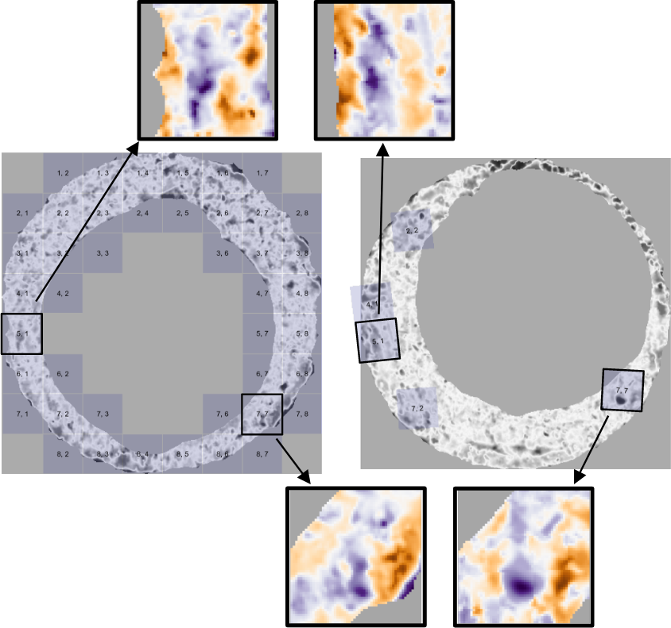

\defcitealias{council_strengthening_2009}{NRC (2009)}
\defcitealias{pcast2016}{PCAST (2016)}

```{r setup, include=FALSE}
# Use fig.process to rename figure files generated by R so that they comply with
# the journal naming policies. Remember to name plot chunks with the format
# "Figure1", "Figure2", etc... You will find the figure files in
# `[...]_files/figure-latex/`.

knitr::opts_chunk$set(
  echo = TRUE,
  out.width="\\reprintcolumnwidth",
  fig.process = function(x) {
    x2 = sub('-\\d+([.][a-z]+)$', '\\1', x)
    if (file.rename(x, x2)) x2 else x
  }
)

# The JASA LaTeX class depends on the LaTeX package "revtex4-1". If you are
# using a full LaTeX distro, you should make sure "revtex4-1" is installed, and
# install it if not. If you are using TinyTeX, the following code will take care
# of installing the package for you.

if (tinytex::is_tinytex() && !tinytex::check_installed('revtex4-1')) {
  tinytex::tlmgr_install("revtex4-1")
}
```

```{r,include=FALSE}
library(x3ptools)
library(cmcR)
library(impressions)

library(patchwork)
library(tidyverse)
```


# Introduction {#introduction}

A *cartride case* is the part of firearm ammunition that houses the projectile and propulsive device.
When a firearm is discharged and the projectile travels down the barrel, the cartridge case moves in the opposite direction and slams against the back wall, the *breech face*, of the firearm.
Markings on the breech face are "stamped" into the surface of the cartridge case leaving so-called *breech face impressions*.

In a traditional examination, forensic examiners use these impressions analogous to a fingerprint to determine whether two cartridge cases were fired from the same firearm.
First, two cartridge cases are collected - perhaps one is from a crime scene and the other is collected from a suspect's gun.
An examiner places the two cartridge cases beneath a "comparison microscope" that merges the views of two compound microscopes into a single split view.
The examiner assesses the "degree of similarity" between the markings on the cartridge cases and reaches either an *identification*, meaning the cartridge cases were fired from the same firearm, an *elimination*, meaning they were fired from different firearms, or an *inconclusive*, meaning the evidence is insufficient to make an identification or elimination [@AFTE1992].^[The AFTE range of conclusions also permits the examiner to decide that the evidence is *unsuitable* for examination, which can occur if evidence quality is poor; for example, a fragment of a cartridge case is recovered rather than a full cartridge case.]

Critics of traditional forensic examinations cite a lack of "foundational validity" underlying the procedures used by firearm and toolmark examiners [@council_strengthening_2009; @pcast2016].
In particular, examiners rely largely on their subjective findings rather than on a well-defined procedure to measure similarity.
\citetalias{pcast2016} pushed for "developing and testing image-analysis algorithms" to objectively measure the similarity between cartridge cases.
Some recently proposed methods focus on measuring similarity using binary rules **[better way to say that?]** **[CITATIONS]**.
These methods have the benefit of being interpretable, although recent work has demonstrated that they can be highly sensitive to parameter choice [@Zemmels2023].

In this paper, we propose a model-based procedure for measuring the similarity between two digital scans of cartridge cases.
Our procedure measures similarity using a set of numerical features rather than binary rules.
The result is a continuous score obtained by evaluating a trained statistical model, which adds nuance to the similarity measure past concluding that the cartridge cases did or did not originate from the same firearm.

In the following sections, we first review recently proposed algorithms to compare firearm evidence.
We introduce our similarity scoring pipeline and share results of applying the pipeline to a data set of cartridge case scans available at **[data repo citation]**.
We discuss how our proposed method builds upon previously proposed methods to obtain nuanced, informative, and robust similarity measures.

## Previous Work

Recent proposals for automatic cartridge case scoring algorithms borrow from image processing and computer vision techniques.
For example, @vorburger_surface_2007 proposed using the cross-correlation function (CCF) to compare images or scans of cartridge case surfaces.
The CCF measures the similarity between two matrices for all possible translations of one matrix against the other.
Calculating the CCF while rotating one of the scans therefore allows for estimation of the optimal translation and rotation, together referred to as the *registration*, between the two scans;  simply choose the rotation/translation at which the CCF is maximized.
@hare_automatic_2016 used the CCF, among other features, to compare scans of bullets.
@tai_fully_2018 developed an open-source cartridge case comparison pipeline that compared cartridge case images using the CCF.

@song_proposed_2013 noted that two matching cartridge cases often share similar impressions in specific regions, so calculating the CCF between two full scans may not highlight their similarities.
Instead, @song_proposed_2013 proposed partitioning one cartridge case scan into a grid of "cells" and calculating the CCF between each cell and the other scan.
If two cartridge cases are truly matching, then the maximum CCF value between each cell and the other scan, particularly the cells containing distinguishable breech face impressions, should be relatively large.
Furthermore, the cells should "agree" on the registration at which the CCF is maximized.
@song_proposed_2013 outlined the "Congruent Matching Cells" algorithm to determine the number of cells that agree on a particular registration.
A cell is classified as a Congruent Matching Cell (CMC) if its estimated registration is within some threshold of the median registration across all cells and its CCF value is above some threshold.
A number of follow-up papers proposed alterations to the the original CMC method [@tong_improved_2015; @chen_convergence_2017].
@cmcR introduced an open-source implementation of the CMC method in the `cmcR` R package.
As an alternative to defining Congruent Matching Cells, @zhang_convergence_2021 proposed using a clustering algorithm from @Ester1996 to determine the number of cells in agreement on a specific registration.

Currently, none of these papers have proposed rigorous procedure for comparing different cartridge case comparison algorithms.
This includes selecting optimal parameters for a specific algorithm.
@Zemmels2023 proposed an optimization criterion to select parameters for the CMC algorithm.
Analogously, @hare_automatic_2016 developed a validation procedure to select parameters for a bullet comparison algorithm.
In this work, we introduce a novel cross-validation procedure to learn and test optimal parameters for this cartridge case algorithm.

# Methods {#methods}

We now discuss the methods behind the comparison algorithm. We divide the methods into three stages:

1. **Pre-processing**: prepare cartridge case scans for comparison

2. **Comparing**: compare two cartridge cases and compute similarity features

3. **Scoring**: measure the similarity between the two cartridge cases using a trained classifier

The following sections detail each of these stages.
Throughout, we treat "surface matrix" and "scan" synonymously.

After taking a topographical scan of the cartridge case surfaces, we manually annotate the breech face impression region (shown in red).
We automatically pre-process and compare the scans resulting in a similarity score, either a binary classification or class probability, derived from a classifier model.
As we pointed out in Chapter 2, prosaic descriptions like the following are insufficient to reproduce an algorithm.
We refer the reader to <https://github.com/jzemmels/jdssvSubmission/tree/main/supplementary-code> for the source code used to implement the method and derive the results presented.

## Pre-processing

We first use the open-source FiX3P web application (<https://github.com/talenfisher/fix3p>) to manually annotate the breech face impression region.
The FiX3P software includes functionality to "paint" the surface of a cartridge case using a computer cursor and save the painted regions to a *mask.* A mask is a 2D array of hexidecimal color values of the same dimension as its associated surface matrix.
When initialized, every element of a mask is a shade of brown (#cd7f32) by default.
Any elements painted over by the user will be replaced with the user's selected color value.

We pre-process the raw scans by applying a sequence of functions available in the R packages `x3ptools` [@x3ptools] and `cmcR` [@cmcR].
\autoref{fig:preProcessEffect} shows the effect that each function has on the scan surface values.
Gray pixels in each plot represent missing values in the surface matrix.
The `x3p_delete` function removes values in the scan based on the associated mask.
Next, the `preProcess_removeTrend` function subtracts a fitted conditional median plane from the surface values to "level-out" any global tilt in the scan.
The `preProcess_gaussFilter()` function applies a bandpass Gaussian filter with wavelength cutoff values 16 and 500 microns to remove small-scale noise and other large-scale structure, which better highlights the medium-scale breech face impressions.
Finally, the `preProcess_erode()` function applies the morphological operation of erosion with a circular structuring element of radius 12 on the edge of the non-missing surface values [@Haralick1987].
This has the effect of shaving off values on the interior and exterior edge of the surface, which are often extreme "roll-off" values that unduly affect the comparing stage if not removed.
The final result is a cartridge case surface matrix with emphasized breech face impressions.

```{r preprocessExampleCode,cache=TRUE,include=FALSE}
reference <- x3p_read("data/NIST_K013sA1.x3p")
target <- x3p_read("data/NIST_K013sA2.x3p")

reference$surface.matrix <- reference$surface.matrix*1e6
target$surface.matrix <- target$surface.matrix*1e6

reference_deleted <- reference %>%
  impressions::x3p_delete(mask_vals = "#CD7F32FF") %>%
  x3ptools::x3p_sample(m = 4)

reference_detrend <- reference %>%
  impressions::x3p_delete(mask_vals = "#CD7F32FF") %>%
  cmcR::preProcess_removeTrend(statistic = "quantile",
                               tau = .5,
                               method = "fn") %>%
  x3ptools::x3p_sample(m = 4)

reference_filtered <- reference %>%
  impressions::x3p_delete(mask_vals = "#CD7F32FF") %>%
  cmcR::preProcess_removeTrend(statistic = "quantile",
                               tau = .5,
                               method = "fn") %>%
  cmcR::preProcess_gaussFilter() %>%
  x3p_sample() %>%
  cmcR::preProcess_removeTrend(statistic = "quantile",
                               tau = .5,
                               method = "fn") %>%
  cmcR::preProcess_gaussFilter() %>%
  x3p_sample()

reference_eroded <- reference %>%
  impressions::x3p_delete(mask_vals = "#CD7F32FF") %>%
  cmcR::preProcess_removeTrend(statistic = "quantile",
                               tau = .5,
                               method = "fn") %>%
  cmcR::preProcess_gaussFilter() %>%
  x3p_sample() %>%
  cmcR::preProcess_removeTrend(statistic = "quantile",
                               tau = .5,
                               method = "fn") %>%
  cmcR::preProcess_gaussFilter() %>%
  x3p_sample() %>%
  cmcR::preProcess_erode(region = "interior",morphRadius = round(50/4)) %>% 
  cmcR::preProcess_erode(region = "exterior",morphRadius =  round(50/4)) %>%
  impressions::x3p_cropWS()

target_eroded <- target %>%
  impressions::x3p_delete(mask_vals = "#CD7F32FF") %>%
  cmcR::preProcess_removeTrend(statistic = "quantile",
                               tau = .5,
                               method = "fn") %>%
  cmcR::preProcess_gaussFilter() %>%
  x3p_sample() %>%
  cmcR::preProcess_removeTrend(statistic = "quantile",
                               tau = .5,
                               method = "fn") %>%
  cmcR::preProcess_gaussFilter() %>%
  x3p_sample() %>%
  cmcR::preProcess_erode(region = "interior",morphRadius = round(50/4)) %>% 
  cmcR::preProcess_erode(region = "exterior",morphRadius =  round(50/4)) %>%
  impressions::x3p_cropWS()
```

```{r,cache = FALSE,include=FALSE}
plts <- impressions::x3pPlot(reference_deleted,reference_detrend,reference_filtered,reference_eroded,
                             x3p.names = c("x3p_delete()","preProcess_removeTrend()",
                                          "preProcess_gaussFilter()","preProcess_erode()"),
                             output = "list",
                             legend.quantiles = c(0,.5,1)) %>%
  map(~ {
    . +
      theme(legend.position = "bottom") +
      ggplot2::guides(fill = ggplot2::guide_colourbar(barwidth = grid::unit(1.25, 
                                                                            "in"), 
                                                      barheight = grid::unit(.2,"in"),
                                                      label.theme = ggplot2::element_text(size = 6), 
                                                      title.theme = ggplot2::element_text(size = 8), 
                                                      title.vjust = .8,
                                                      frame.colour = "black",
                                                      ticks.colour = "black",
                                                      direction = "horizontal"), 
                      colour = "none") + 
      ggplot2::labs(fill = expression("Rel. Height ["*mu*"m]"))
  })

plt <- (plts[[1]] | plts[[2]] | plts[[3]] | plts[[4]])

ggsave(plot = plt,filename = "figures/preProcessEffect.png",width = 10,height = 5)
knitr::plot_crop("figures/preProcessEffect.png")
```


```{r,out.width="\\textwidth",echo=FALSE,fig.pos="htbp",fig.cap="\\label{fig:preProcessEffect} We apply a sequence of pre-processing functions to each scan. Each pre-processing step further emphasizes the breech face impressions in the scan."}

```

Next, we compute a set of similarity features for two pre-processed cartridge case scans.

## Comparing

In this section, we introduce a set of similarity features for two cartridge case scans.
We calculate features at two scales: between two full scans and between individual cells.
Analogous to how a forensic examiner uses a comparison microscope with different magnification levels, this allows us to assess the similarity between two scans at the macro and micro levels.

### Notational Conventions

First, we introduce notation that will be used to define the features.
Let $A$ and $B$ denote two surfaces matrices that we wish to compare.
For simplicity, we assume $A,B \in \mathbb{R}^{k \times k}$ for a positive integer $k$.\footnote{This assumption of equally-sized, square matrices is easily enforced by padding the matrices with additional missing values.
Due to the presence of (structurally) missing values around the breech face impression region, additional padding does not interfere with the structure of the scan.}
We use lowercase letters and subscripts to denote a particular value of a matrix: $a_{ij}$ is the value in the $i$-th row and $j$-th column, indexed starting from the top-left corner, of matrix $A$.
In the following sections, we will use the two known-match cartridge cases in \autoref{fig:matchPair} as example matrices $A$ and $B$.

To accommodate structurally missing values, we adapt standard matrix algebra by encoding the notion of "missingness" into the space of real values as follows: if an element of either matrix $A$ or $B$ is missing, then any element-wise operation including this element is also missing.
Standard matrix algebra holds for non-missing elements.
For example, the addition operator is defined as:
\begin{align*}
A \oplus_{NA} B = (a_{ij} \oplus_{NA} b_{ij})_{1 \leq i,j \leq k} = 
\begin{cases}
a_{ij} + b_{ij} & \text{if both $a_{ij}$ and $b_{ij}$ are numbers} \\
NA &\text{otherwise}
\end{cases}
\end{align*}
Other element-wise operations such as $\ominus_{NA}$ are defined similarly.
For readability, we will use standard operator notation $+, -, >, <, I(\cdot), ...$ and assume the extended, element-wise operations as defined above.
Note that this definition of dealing with missing values is consistent with a setting of `na.rm = FALSE` in terms of calculations in R [@Rlanguage].

<!-- \hh{XXX Differences are based on only the overlapping space. Should we keep track of how many values are missing in one but not the other scan (cell)? There might be information in how well the registration worked. } -->

```{r,cache=FALSE,include=FALSE}
plt <- impressions::x3pPlot(reference_eroded,target_eroded,x3p.names = c("Scan A","Scan B"),legend.length = grid::unit(4, "in"))

ggsave(filename = "figures/matchPair.png",plot = plt,height = 7,width = 10)
knitr::plot_crop("figures/matchPair.png")
```


```{r,out.width="\\textwidth",echo=FALSE,fig.pos="htbp",fig.cap="\\label{fig:matchPair} A matching pair of processed cartridge case scans. We measure the similarity between these cartridge cases using the distinguishable breech face impressions on their surfaces."}
knitr::include_graphics("figures/matchPair.png")
```

### Registration Estimation

A critical step in comparing $A$ and $B$ is to find a transformation of $B$ such that it aligns best to $A$ (or vice versa).
In image processing, this is called *image registration.* 
Noting that $A$ and $B$ are essentially grayscale images with structurally missing values, we rely on a standard image registration technique [@Brown1992].

In our application, a registration is composed of a discrete translation by $(m,n) \in \mathbb{Z}^2$ and rotation by $\theta \in [-180^\circ,180^\circ]$.
To determine the optimal registration, we calculate the *cross-correlation function* (CCF) between $A$ and $B$, which measures the similarity between $A$ and $B$ for every possible translation of $B$, denoted $(A \star B)$.
We estimate the registration by calculating the maximum CCF value across a range of rotations of matrix $B$.
Let $B_\theta$ denote $B$ rotated by an angle $\theta \in [-180^\circ,180^\circ]$ and $b_{\theta_{mn}}$ the $m,n$-th element of $B_\theta$.
Then the estimated registration $(m^*,n^*,\theta^*)$ is: 

$$
(m^*,n^*,\theta^*) = \arg \max_{m,n,\theta} (a \star b_\theta)_{mn}.
$$

In practice we consider a discrete grid of rotations $\pmb{\Theta} \subset [-180^\circ,180^\circ]$.
The registration procedure is outlined in \autoref{alg:registration}.
We refer to the matrix that is rotated as the "target."
The result is the estimated registration of the target matrix to the "source" matrix.

```{=tex}
\begin{algorithm}[htbp]
\KwData{Source matrix $A$, target matrix $B$, and rotation grid $\pmb{\Theta}$}
\KwResult{Estimated registration of $B$ to $A$, $(m^*,n^*,\theta^*)$, and cross-correlation function maximum, $CCF_{\max}$}
\For{$\theta \in \pmb{\Theta}$}{
Rotate $B$ by $\theta$ to obtain $B_\theta$\;
Calculate $CCF_{\max, \theta} = \max_{m,n} (a \star b_{\theta})_{mn}$\;
Calculate translation $[m^*_\theta,n^*_\theta] = \arg \max_{m,n} (a \star b_{\theta})_{mn}$
}
Calculate overall maximum correlation $CCF_{\max} = \max_{\theta} \{CCF_{\max,\theta} : \theta \in \pmb{\Theta}\}$\;
Calculate rotation $\theta^* = \arg \max_{\theta} \{CCF_{\max,\theta} : \theta \in \pmb{\Theta}\}$\;
\Return{Estimated rotation $\theta^*$, translation $m^* = m^*_{\theta^*}$ and $n^* = n^*_{\theta^*}$, and $CCF_{\max}$}
\caption{Image Registration Procedure}
\label{alg:registration}
\end{algorithm}
```


To accommodate missing values, we also compute the *pairwise-complete correlation* using only the complete value pairs, meaning neither value is missing, between $A$ and $B$.

### Registration-Based Features

#### Full-Scan Registration

We first estimate the registration between two full scans $A$ and $B$ using \autoref{alg:registration} with a rotation grid $\pmb{\Theta} = \{-30^\circ, -27^\circ,...,27^\circ,30^\circ\}$.
This results in an estimated registration $(m^*,n^*,\theta^*)$ and similarity measure $CCF_{\max}$.
We also perform \autoref{alg:registration} with the roles of $A$ and $B$ reversed, meaning the target scan $A$ is aligned to source scan $B$.

To accommodate these two comparison directions, we introduce a new subscript $d = A,B$, referring to the source scan in Image Registration Algorithm.
Consequently, we obtain two sets of estimated registrations, $(m^*_d,n^*_d,\theta^*_d)$ and $CCF_{\max,d}$, for $d=A,B$.\footnote{In reality, the true aligning registrations in the two comparison directions are opposites of each other. However, because we compare discretely-indexed arrays using a nearest-neighbor interpolation scheme, the estimated registrations may differ slightly.}
For $d = A$, we then apply the registration transformation $(m^*_A,n^*_A,\theta^*_A)$ to $B$ to obtain $B^*$ and compute the pairwise-complete correlation, $cor_{\text{full},A}$, between $A$ and $B^*$.
We repeat this in the other comparison direction to obtain $cor_{\text{full},B}$ and average the two:

$$
cor_{\text{full}} = \frac{1}{2}\left(cor_{A,\text{full}} + cor_{B,\text{full}}\right).
$$

We assume that the **full-scan pairwise-complete correlation** is large for truly matching cartridge cases.

#### Cell-Based Registration

We next perform a cell-based comparison procedure, which begins with selecting one of the matrices, say $A$, as the "source" matrix that is partitioned into a grid of cells.
The left side of \autoref{fig:cellGridExample} shows an example of such a cell grid overlaid on a scan.
Each of these source cells will be compared to the "target" matrix, in this case $B^*$.
Because $A$ and $B^*$ are already partially aligned from the full-scan registration procedure, we compare each source cell to $B^*$ using a new rotation grid of $\pmb{\Theta}'_A = \{\theta^*_A - 2^\circ, \theta^*_A - 1^\circ,\theta^*_A,\theta^*_A + 1^\circ,\theta^*_A + 2^\circ\}$.

We now extend the surface matrix notation introduced previously to accommodate cells.
Let $A_{t}$ denote the $t$-th cell of matrix $A$, $t = 1,...,T_A$ where $T_A$ is the total number of cells containing non-missing values in scan $A$ (e.g., $T_A = 43$ in \autoref{fig:cellGridExample}) and let $(a_t)_{ij}$ denote the $i,j$-th element of $A_t$.

The cell-based comparison procedure is outlined in \autoref{alg:cellComparison}.

```{=tex}
\begin{algorithm}[H]
\KwData{Source matrix $A$, target matrix $B^*$, grid size $R \times C$, and rotation grid $\pmb{\Theta}'_A$}
\KwResult{Estimated translations and $CCF_{\max}$ values per cell, per rotation}
Partition $A$ into a grid of $R \times C$ cells\;
Discard cells containing only missing values, leaving $T_A$ remaining cells\;
\For{$\theta \in \pmb{\Theta}'_A$}{
Rotate $B^*$ by $\theta$ to obtain $B^*_\theta$\;
\For{$t = 1,...,T_A$}{
Calculate $CCF_{\max, A,t,\theta} = \max_{m,n} (a_t \star b^*_\theta)_{mn}$\;
Calculate translation $[m^*_{A,t,\theta},n^*_{A,t,\theta}] = \arg \max_{m,n} (a_t \star b^*_\theta)_{mn}$
}
}
\Return{$\pmb{F}_A = \{(m^*_{A,t,\theta},n^*_{A,t,\theta}, CCF_{\max,A,t,\theta}, \theta) : \theta \in \pmb{\Theta}'_A, t = 1,...,T_A\}$}
\caption{Cell-Based Comparison Procedure}
\label{alg:cellComparison}
\end{algorithm}
```

Rather than exclusively returning the registration that maximizes the overall CCF as in \autoref{alg:registration}, \autoref{alg:cellComparison} returns the set $\pmb{F}_A$ of translations and CCF values for each of the $T_A$ cells and each rotation in $\pmb{\Theta}'_A$.

```{r,out.width="\\textwidth",echo=FALSE,fig.pos="htbp",fig.cap="\\label{fig:cellGridExample} Estimated registrations of cells from a non-match pair of cartridge cases. A source scan (left) is separated into an $8 \\times 8$ grid of cells. We exclude cells containing only missing values (visualized here as gray pixels). Each source cell is compared to a target scan (right) to estimate where it aligns best. We show a handful of cells at their estimated alignment in the target scan and magnify the surfaces captured by cell pairs 5, 1 and 7, 7. Although the cartridge case pair is non-matching, we note that there are similarities in the surface markings for these cell pairs."}

```

\autoref{fig:cellGridExample} shows the estimated registrations of cells between two non-match cartridge cases.
We magnify the surface values captured by cell pairs 5, 1 and 7, 7 and note the similarities in the surface values;  for example, the dark purple region in the middle of the cell 7, 7 pair.

Just as with the whole-scan registration, we calculate the pairwise-complete correlation between each cell $A_t$ and a matrix $B_{\theta,t}^*$ of the same size extracted from $B^*_{\theta}$ after translating by $[m^*_{A,\theta},n^*_{A,\theta}]$.
From this we obtain a set of pairwise-complete correlations for each cell and rotation: $\{cor_{A,t,\theta} : t = 1,...,T_A, \theta \in \pmb{\Theta}'_A\}$.

We repeat \autoref{alg:cellComparison} and the pairwise-complete correlation calculation using $B$ as the source scan and $A^*$ as the target, resulting in cell-based registration set $\pmb{F}_B$ and pairwise-complete correlations $\{cor_{B,t,\theta} : t = 1,...,T_B, \theta \in \pmb{\Theta}'_B\}$.

For $d = A,B$ and $t = 1,...,T_d$, define the cell-wise maximum pairwise-complete correlation as: 

$$
cor_{d,t} = \max_{\theta} \{cor_{d,t,\theta} : \theta \in \pmb{\Theta}'_d\}.
$$

We compute two features, the **average** and **standard deviation of the cell-based pairwise-complete correlations**, using the correlation data:

\begin{align*}
\overline{cor}_{\text{cell}} &= \frac{1}{T_A + T_B} \sum_{d \in \{A,B\}} \sum_{t=1}^{T_d} cor_{d,t} \\
s_{cor} &= \sqrt{\frac{1}{T_A + T_B - 1} \sum_{d \in \{A,B\}} \sum_{t=1}^{T_d} (cor_{d,t} - \overline{cor}_{\text{cell}})^2}.
\end{align*} 

We expect $\overline{cor}_{\text{cell}}$ and $s_{cor}$ to be large for truly matching cartridge case pairs relative to non-matching pairs.

For $d = A,B$ and $t = 1,...,T_d$, define the per-cell estimated translations and rotation as: 

\begin{align*}
\theta^*_{d,t} &= \arg \max_{\theta} \{CCF_{\max,d,t,\theta} : \theta \in \pmb{\Theta}'_d\} \\
m^*_{d,t} &= m^*_{\theta^*_{d,t},d,t} \\
n^*_{d,t} &= n^*_{\theta^*_{d,t},d,t}.
\end{align*} 

We compute the **standard deviation of the cell-based estimated registrations** using the estimated translations and rotations:

\begin{align*}
s_{\theta^*} =  \sqrt{\frac{1}{T_A + T_B - 1} \sum_{d \in \{A,B\}} \sum_{t=1}^{T_d} (\theta^*_{d,t} - \bar{\theta}^*)^2} \\
s_{m^*} =  \sqrt{\frac{1}{T_A + T_B - 1} \sum_{d \in \{A,B\}} \sum_{t=1}^{T_d} (m^*_{d,t} - \bar{m}^*)^2} \\
s_{n^*} = \sqrt{\frac{1}{T_A + T_B - 1} \sum_{d \in \{A,B\}} \sum_{t=1}^{T_d} (n^*_{d,t} - \bar{n}^*)^2}
\end{align*}

where 

\begin{align*}
\bar{m}^* &= \frac{1}{T_A + T_B} \sum_{d \in \{A,B\}}\sum_{t=1}^{T_d} m^*_{d,t} \\
\bar{n}^* &= \frac{1}{T_A + T_B} \sum_{d \in \{A,B\}} \sum_{t=1}^{T_d} n^*_{d,t} \\
\bar{\theta}^* &= \frac{1}{T_A + T_B} \sum_{d \in \{A,B\}} \sum_{t=1}^{T_d} \theta^*_{d,t}.
\end{align*}

We expect $s_{\theta^*}, s_{m^*},s_{n^*}$ to be small for truly matching cartridge case pairs relative to non-matching pairs.

From the full-scan and cell-based registration procedures, we obtain six features summarized in \autoref{tab:registrationFeatures}.

```{=tex}
\begin{table}[htbp]
\centering
\begin{tabular}{p{.11\linewidth} p{.7\linewidth}}
$cor_{\text{full}}$ & Full-scan pairwise-complete correlation \\
$\overline{cor}_{\text{cell}}$ & Average cell-based pairwise-complete correlation \\
$s_{cor}$ & Standard deviation of the cell-based pairwise-complete correlations \\
$s_{m^*}$ & Standard deviation of the cell-based vertical translations (in microns) \\
$s_{n^*}$ & Standard deviation of the cell-based horizontal translations (in microns) \\
$s_{\theta^*}$ & Standard deviation of the cell-based rotations (degrees)
\end{tabular}
\caption{Six similarity features based on registering full scans and cells.}
\label{tab:registrationFeatures}
\end{table}
```


<!-- \hline -->
<!-- $\overline{CCF}_{\max, \cdot}$ & Average maximum value of the cross-correlation function across all cells and rotations \\ -->
<!-- \hline -->
<!-- $s_{CCF}^2$ & Sample variance of the maximum CCF values across all cells \\ -->

### Density-Based Features

We wish to identify when multiple cells agree on, or cluster around, a particular registration value.
However, pursuant with the notion that only certain regions of matching cartridge cases contain distinctive markings, it is unreasonable to assume and empirically rare that **all** cells agree on a single registration.
In fact, it is common for many cells to disagree on a registration.
For example, the left scatterplot in \autoref{fig:dbscanScatterplot} shows the per-cell estimated translations $[m^*_{A,t,\theta}, n^*_{A,t,\theta}]$ when scan $A$ is used as source and $B^*$ as target rotated by $\theta = 3^\circ$.
The right scatterplot shows the per-cell estimated translations with the roles of $A$ and $B^*$ reversed for $\theta = -3^\circ$.
We see distinctive clusters, the black points, in both plots among many noisy, gray points.
The task is to isolate the clusters amongst such noise.

We use the Density-Based Spatial Clustering of Applications with Noise (DBSCAN) algorithm proposed by @Ester1996 to identify clusters.
Compared to other clustering algorithms such as k-means [@MacQueen1967], DBSCAN does not require a pre-defined number of expected clusters.
Instead, the algorithm forms clusters if the number of points within an $\epsilon > 0$ distance of a point exceeds some pre-defined threshold, $minPts > 1$.
If a point does not belong to a cluster, then DBSCAN labels that point as "noise."
In \autoref{fig:dbscanScatterplot}, we use DBSCAN with $\epsilon = 5$ and $minPts = 5$ to identify clusters of size 14 and 13, respectively, visualized as black points.
These cluster sizes suggest that the scans match.
Additionally, the mean cluster centers are approximately opposites of each other: $(\hat{m}_A,\hat{n}_A,\hat{\theta}_A) \approx (16.9, -16.7, 3^\circ)$ when $A$ is used as source compared to $(\hat{m}_B,\hat{n}_B,\hat{\theta}_B) \approx (-16.2, 16.8, -3^\circ)$ when $B^*$ is used as source.
This provides further evidence of a match.

```{r,include=FALSE}
load("data/compData.RData")
```


```{r,cache=FALSE,include=FALSE}
estimRotations <- compData %>%
  group_by(direction,theta) %>%
  group_split() %>%
  map_dfr(function(dat){
    
    densEstim <- MASS::kde2d(x = dat$x,y = dat$y,n = 100)
    
    data.frame(maxDens = max(c(densEstim$z)),
               theta = unique(dat$theta),
               direction = unique(dat$direction))
    
  }) %>%
  group_by(direction) %>%
  dplyr::top_n(n = 1,wt = maxDens) %>%
  select(direction,theta) %>%
  rename(thetaHat = theta)

plt1 <- compData %>%
  select(-c(cellHeightValues,alignedTargetCell)) %>%
  left_join(estimRotations,by = "direction") %>%
  filter(theta == thetaHat) %>%
  mutate(direction = factor(direction,labels = c("Scan A vs. Scan B*","Scan B* vs. Scan A")),
         label = paste0(direction,", Rotation: ",theta)) %>%
  filter(direction == "Scan A vs. Scan B*") %>%
  group_by(label) %>%
  group_split() %>%
  map_dfr(function(dat){
    
    dat %>%
      mutate(clust = dbscan::dbscan(x = dat %>% select(x,y),eps = 5,minPts = 5)$cluster,
             clust = factor(ifelse(clust == 0,0,1),labels = c("Noise","Cluster")))
    
  }) %>%
  ggplot(aes(x=x,y,y,colour = clust)) +
  # geom_point() +
  geom_jitter(width = 3,height = 3,size = 1) +
  coord_fixed(expand = TRUE) +
  facet_wrap(~ label,nrow = 1) +
  theme_bw() +
  labs(x = "horizontal shift n",
       y = "vertical shift m",
       colour = "DBSCAN") +
  theme(axis.text = element_text(size = 6),
        legend.position = "bottom") +
  geom_vline(xintercept = 0,linetype = "dashed") +
  geom_hline(yintercept = 0,linetype = "dashed") +
  scale_colour_manual(values = c("gray65","black")) +
  xlim(c(-100,100)) +
  ylim(c(-100,100)) +
  theme(legend.position = "none")

plt2 <- compData %>%
  select(-c(cellHeightValues,alignedTargetCell)) %>%
  left_join(estimRotations,by = "direction") %>%
  filter(theta == thetaHat) %>%
  mutate(direction = factor(direction,labels = c("Scan A vs. Scan B*","Scan B* vs. Scan A")),
         label = paste0(direction,", Rotation: ",theta)) %>%
  filter(direction == "Scan B* vs. Scan A") %>%
  group_by(label) %>%
  group_split() %>%
  map_dfr(function(dat){
    
    dat %>%
      mutate(clust = dbscan::dbscan(x = dat %>% select(x,y),eps = 5,minPts = 5)$cluster,
             clust = factor(ifelse(clust == 0,0,1),labels = c("Noise","Cluster")))
    
  }) %>%
  ggplot(aes(x=x,y,y,colour = clust)) +
  # geom_point() +
  geom_jitter(width = 3,height = 3,size = 1) +
  coord_fixed(expand = TRUE) +
  facet_wrap(~ label,nrow = 1) +
  theme_bw() +
  labs(x = "(negative) horizontal shift n",
       y = "(negative) vertical shift m",
       colour = "DBSCAN") +
  theme(axis.text = element_text(size = 6),
        legend.position = "bottom") +
  geom_vline(xintercept = 0,linetype = "dashed") +
  geom_hline(yintercept = 0,linetype = "dashed") +
  scale_colour_manual(values = c("gray65","black")) +
  scale_x_reverse(limits = c(100,-100)) +
  scale_y_reverse(limits = c(100,-100)) +
  theme(legend.position = "none")

pltLegend <- plt1 %>%
  cowplot::get_legend() %>%
  cowplot::plot_grid()

ggsave(filename = "figures/dbscanScatterplot.png", plot = plt1+plt2, 
       width = 8, height = 4)
knitr::plot_crop("figures/dbscanScatterplot.png")
```


```{r,out.width=".8\\textwidth",echo=FALSE,fig.pos="htbp",fig.cap="\\label{fig:dbscanScatterplot} Cluster assignments based on the Density Based Spatial Clustering with Applications to Noise (DBSCAN) algorithm for estimated translations in two comparison directions. Using scan $A$ as source results in a cluster of size 14 (left) compared to 13 when scan $B^*$ is used as source (right). Noting the reversed axes in the right plot, we see that the clusters are located approximately opposite of each other. Points are jittered for visibility."}
knitr::include_graphics("figures/dbscanScatterplot.png")
```

To calculate the density-based features, we first use a 2D kernel density estimator [@MASS] to identify the rotation $\hat{\theta}_d$ at which the per-cell translations achieve the highest density.
Next, we compute clusters using the DBSCAN algorithm amongst the estimated translations $\{(m^*_{d,t,\hat{\theta}_d},n^*_{d,t,\hat{\theta}_d}) : t = 1,...,T_d\}$ like those shown in \autoref{fig:dbscanScatterplot}.^[If more than one cluster is identified, we binarize the points based on whether they were assigned to any cluster or if they are a noise point and proceed as if there is only one cluster. We assume that two or more clusters form only because of the course rotation grid considered. Were a finer grid used, the points would coalesce into a single cluster around the true translation value. This assumption has empirical support through our experimentation.]
Let $\pmb{C}_d$ denote the set of cells in the DBSCAN cluster.
We treat the mean cluster centers as the estimated translations $[\hat{m}_d,\hat{n}_d]$.

We calculate four features from the density-based clustering procedure: **average DBSCAN cluster size** $C$, the **DBSCAN cluster indicator** $C_0$, and the **root sum of squares of the dens**ity-estimated registrations $(\Delta_\theta, \Delta_{\text{trans}})$ defined as:

\begin{align*}
C &= \frac{1}{2}\left(|\pmb{C}_A| + |\pmb{C}_B|\right) \\
C_0 &= I(|\pmb{C}_A| > 0 \text{ and } |\pmb{C}_B| > 0)\\
\Delta_\theta &= |\hat{\theta}_A + \hat{\theta}_B| \\
\Delta_{\text{trans}} &= \sqrt{(\hat{m}_A + \hat{m}_B)^2 + (\hat{n}_A + \hat{n}_B)^2}
\end{align*} 
where $|\pmb{C}_d|$ denotes the cardinality of $\pmb{C}_d$ and $I(\cdot)$ is the identity function equal to 1 if the predicate argument "$\cdot$" evaluates to TRUE and 0 otherwise.
We use both $C$ and $C_0$ because of potential missingness in the values of $C$ if no cluster is identified.
Missing $C$ values are imputed using the median non-missing value when fitting classifiers, so the missingness information is retained in $C_0$.

For truly matching cartridge case pairs, we expect $C$ to be large and $\Delta_\theta, \Delta_{\text{trans}}$ to be small relative to non-matching pairs and for $C_0$ to be equal to 1. We obtain four density-based features summarized in \autoref{tab:dbscanFeatures}.

```{=tex}
\begin{table}[htbp]
\centering
\begin{tabular}{p{.11\linewidth} p{.7\linewidth}}
$C$ & Average DBSCAN cluster size \\
$C_0$ & DBSCAN cluster indicator \\
$\Delta_\theta$ & Absolute sum of the density-estimated rotations (degrees) \\
$\Delta_{\text{trans}}$ & Root sum of squares of the density-estimated translations (in microns)
\end{tabular}
\caption{Four similarity features based on the density-based clustering procedure.}
\label{tab:dbscanFeatures}
\end{table}
```

# Results {#results}

# Discussion {#discussion}

# Conclusion {#conclusion}


<!-- # Figures {#figures} -->

<!-- ```{r Figure1, echo=FALSE, fig.cap="Caption."} -->
<!-- knitr::include_graphics("figsamp.jpg") -->
<!-- ``` -->

<!-- The only figure formats allowed for submission are the following: `.pdf`, `.ps`, `.eps`, or `.jpg`. -->
<!-- Figure files must be named in this fashion: -->
<!-- `Figure\#.xxx`, where `\#` is the figure number and `xxx` is the file format -->
<!-- (`Figure1.eps`, `Figure2.jpg`, `Figure3a.ps`, `Figure3b.ps`, etc). -->

<!-- ```{r Figure2, echo=FALSE, fig.cap="A sine wave."} -->
<!-- t <- seq(0, 10, 0.1) -->
<!-- y <- sin(t) -->
<!-- plot(t, y, type = "l", xlab = "time", ylab = "Sine wave") -->
<!-- ``` -->


<!-- # Inline and display math samples -->

<!-- You can also include inline math, like $\sum\nolimits_{i=1}^N a_i$. -->

<!-- The following is a matrix. -->

<!-- $$ -->
<!-- A_{m,n} =  -->
<!--  \begin{pmatrix} -->
<!--   a_{1,1} & a_{1,2} & \cdots & a_{1,n} \\ -->
<!--   a_{2,1} & a_{2,2} & \cdots & a_{2,n} \\ -->
<!--   \vdots  & \vdots  & \ddots & \vdots  \\ -->
<!--   a_{m,1} & a_{m,2} & \cdots & a_{m,n}  -->
<!--  \end{pmatrix} -->
<!-- $$ -->


<!-- # Citations -->

<!-- The code `[@key]` should usually be used for making -->
<!-- citations surrounded by parentheses, where `key` is the BibTeX cite-key. -->
<!-- If you need only the year in parentheses, you may use `@key`. -->

<!-- Some examples: -->

<!-- - Normal journal cite: [@joursamp1] -->

<!-- - Volume number with issue number: [@joursamp3] -->

<!-- - Journal article published online, not yet printed: [published -->
<!-- online, @sampMisc2] -->

<!-- - Book reference: [@booksamp1] -->

<!-- - In press: [in press, @inpress2] -->

<!-- - Website: [@websiteauthyear] -->

<!-- - Inproceedings: [@sampinproceedings3]. -->


<!-- You can add your acknowledgements here (optional). -->
::: {.acknowledgments data-latex=""}
This work was partially funded by the Center for Statistics and Applications in Forensic Evidence (CSAFE) through Cooperative Agreement 70NANB20H019 between NIST and Iowa State University, which includes activities carried out at Carnegie Mellon University, Duke University, University of California Irvine, University of Virginia, West Virginia University, University of Pennsylvania, Swarthmore College and University of Nebraska, Lincoln.

Additionally, we would like to thank the technicians and staff at the Roy J. Carver High Resolution Microscopy Facility for collecting the topographical scans used in this paper.
:::

<!-- Use \appendix* for only one appendix section. -->
\appendix 


